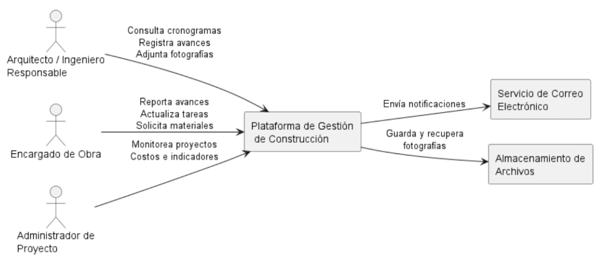

PLATAFORMA DE GESTIÓN DE CONSTRUCCIÓN  
Documento de Diseño de Software

PSWE-04 — Diseño de Software

---

Universidad Cenfotec

Maestría Profesional en Ingeniería del Software

| Nombre del sistema | Plataforma de Gestión de Construcción |
| :---- | :---- |
| Grupo | Grupo 4 |
| Integrantes |  Andrés José Ramírez Ortega<br>Braulio Rivera Espinoza<br>Valery Carvajal Oreamuno |
| URL del repositorio | https://github.com/aramirezor/gestion-construccion.git |
| Docente | Juan Mauricio Leandro |
| Cuatrimestre | 2026 — II Cuatrimestre |
| Versión del documento | 0.5 — Avance 2 |
| Fecha de última actualización | 2026-07-26 |

San José, Costa Rica 2026

Control de Versiones

| Versión | Fecha | Hito | Cambios principales | Autor(es) |
| ----- | ----- | ----- | ----- | ----- |
| 0.1 | 2026-05-26 | Propuesta (S03) | Creación del documento inicial, definición del sistema, alcance, stakeholders y estructura base del documento. | Andrés José Ramírez Ortega María José Hernández López Braulio Rivera Espinoza Valery Carvajal Oreamuno |
| 0.2 | 2026-06-21 | Avance 1 (S07) | Incorporación de drivers arquitectónicos, requerimientos funcionales clave, atributos de calidad prioritarios, restricciones, escenarios de calidad, principios de diseño y vista de contexto. | Andrés José Ramírez Ortega María José Hernández López Braulio Rivera Espinoza Valery Carvajal Oreamuno |
| 0.3 | 2026-06-28 | Avance 1 (S07) - Correcciones | Profundización del problema arquitectónico central (operación offline, política de conflictos y priorización de sincronización); ampliación de stakeholders (Cliente, Bodega, Proveedores); ajuste técnico de drivers arquitectónicos; redefinición de escenarios de calidad con métricas verificables y adición de escenario de resiliencia para fotografías; optimización de la vista de contexto. | Andrés José Ramírez Ortega María José Hernández López Braulio Rivera Espinoza Valery Carvajal Oreamuno |
| 0.4 | 2026-06-28 | Avance 1 (S07) - Ajustes finales | Reestructuración del documento para mantener consistencia con el alcance del avance; fortalecimiento de la lógica y coherencia entre las secciones; refinamiento de la descripción del sistema, drivers arquitectónicos, escenarios de calidad y vista de contexto; eliminación de secciones no desarrolladas y corrección de numeración, formato y redacción general. | Andrés José Ramírez Ortega María José Hernández López Braulio Rivera Espinoza Valery Carvajal Oreamuno |
| 0.5 | 2026-07-26 | Avance 2 (S11) | Incorporación de la vista de estructura interna y la vista de comportamiento; definición del estilo arquitectónico y análisis de sus trade-offs; documentación del registro de decisiones arquitectónicas (ADR); diseño detallado del componente de Registro de Avances (diagrama de clases, robustez y contrato de interfaz); revisión y actualización general del documento para mantener la consistencia entre las vistas, los escenarios de calidad y las decisiones de diseño. | Andrés José Ramírez Ortega María José Hernández López Braulio Rivera Espinoza Valery Carvajal Oreamuno |
|  |  |  |  |  |

# 

# Documentación del Proyecto

## Tabla de Contenido

1. Descripción del Sistema y Alcance
   - 1.1 Descripción General
   - 1.2 Contexto del Negocio o Dominio
   - 1.3 Alcance del Sistema
   - 1.4 Usuarios y Casos de Uso Principales

2. Stakeholders

3. Drivers Arquitectónicos
   - 3.1 Requerimientos Funcionales Clave
   - 3.2 Atributos de Calidad Prioritarios
   - 3.3 Restricciones que Actúan como Drivers

4. Desafío Arquitectónico Principal

5. Escenarios de Calidad

6. Restricciones

7. Principios de Diseño

8. Vistas Arquitectónicas
   - 8.1 Vista de contexto
   - 8.2 Vista de estructura interna
   - 8.3 Vista de comportamiento
      - 8.3.1 Registro de avance de obra
      - 8.3.2 Sincronización de información

9. Estilo Arquitectónico
   - 9.1 Estilo adoptado
   - 9.2 Alternativas consideradas y rechazadas
   - 9.3 Análisis de trade-offs del estilo elegido

10. Registro de Decisiones Arquitectónicas (ADR)
   - 10.1 ADR-001 – Adopción de una arquitectura monolítica modular
   - 10.2 ADR-002 – Uso de API REST como mecanismo de comunicación entre clientes y backend
   - 10.3 ADR-003 – Selección de PostgreSQL como motor de base de datos
   - 10.4 ADR-004 – Uso de un servicio de almacenamiento de objetos para evidencias fotográficas
   - 10.5 ADR-005 – Soporte para operación offline mediante sincronización diferida
   - 10.6 ADR-006 – Autenticación basada en JWT y control de acceso por roles

11. Diseño Detallado del Primer Componente: Registro de Avance de Obra
   - 11.1 Secuencia del flujo principal
   - 11.2 Diagrama de clases de diseño
   - 11.3 Análisis de robustez
   - 11.4 Contratos de interfaz documentados


# 1\. Descripción del Sistema y Alcance

Este documento presenta el análisis arquitectónico inicial de la **Plataforma de Gestión de Construcción**, desarrollado como parte del proyecto del curso **PSWE-04 Diseño de Sistemas de Software**.

Su propósito es definir el contexto del sistema, los actores involucrados, el alcance, los principales requerimientos y los drivers arquitectónicos que orientarán las decisiones de diseño en las siguientes etapas del proyecto.


## 1.1 Descripción General

La Plataforma de Gestión de Construcción es un sistema diseñado para centralizar la información operativa y administrativa asociada a proyectos de construcción. El sistema permite gestionar materiales, compras, tareas, cronogramas, avances de obra, costos e indicadores de desempeño desde una única plataforma, reduciendo la dependencia de múltiples herramientas aisladas.

La solución está dirigida a pequeñas y medianas empresas constructoras que administran varios proyectos simultáneamente y que actualmente enfrentan dificultades debido a la dispersión de información entre hojas de cálculo, aplicaciones de mensajería, correos electrónicos y documentos compartidos. Esta situación genera duplicidad de información, pérdida de trazabilidad, retrasos en la comunicación y dificultades para monitorear el estado real de los proyectos.

El principal valor del sistema consiste en proporcionar una visión centralizada y consistente de cada proyecto, facilitando la coordinación entre el personal de campo y oficina, mejorando la toma de decisiones y permitiendo un seguimiento más preciso del progreso, los costos y la utilización de los recursos.

Además, la plataforma busca permitir que usuarios ubicados en diferentes entornos de trabajo colaboren sobre la misma información, incluso cuando existan condiciones de conectividad limitada o intermitente.


## 1.2 Contexto del Negocio o Dominio

El sistema opera dentro del dominio de la gestión de proyectos de construcción. En este entorno participan arquitectos, ingenieros, encargados de obra, responsables de compras, personal de bodega y administradores de proyecto, quienes requieren información actualizada para coordinar actividades, controlar recursos y monitorear el avance de las obras.

Actualmente, gran parte de la información es compartida mediante fotografías, mensajería instantánea, reportes manuales y documentos distribuidos. Esta fragmentación dificulta la consulta histórica, la trazabilidad de las decisiones y la consolidación de la información necesaria para la gestión de los proyectos.

El escenario de referencia considera una empresa que administra entre 10 y 15 proyectos simultáneamente, con aproximadamente cuatro arquitectos o ingenieros supervisando múltiples obras. Existen usuarios tanto en campo como en oficina, y los encargados de obra realizan actualizaciones frecuentes sobre tareas, avances y consumo de materiales.

Un aspecto fundamental del dominio es la existencia de sitios de construcción con conectividad limitada o intermitente. Esta condición introduce desafíos relacionados con el registro oportuno de la información y la coordinación entre usuarios distribuidos, aspectos que se desarrollan con mayor detalle en el apartado **4. Desafío Arquitectónico Principal**.


## 1.3 Alcance del Sistema

### Dentro del alcance

- Registro y gestión de inventario de materiales.
- Control de entradas, salidas y consumo de materiales.
- Generación y seguimiento de solicitudes de compra.
- Registro y seguimiento de cotizaciones y órdenes de compra.
- Administración de proveedores.
- Registro de avances diarios o semanales de obra.
- Asociación de fotografías a actividades específicas.
- Gestión y seguimiento de tareas.
- Asignación de responsables.
- Gestión de cronogramas e hitos.
- Monitoreo de costos y presupuesto.
- Generación de reportes personalizados.
- Visualización de indicadores de desempeño.
- Centralización de la información de los proyectos.
- Soporte para operación en entornos con conectividad limitada.

### Fuera del alcance

- Gestión de planillas y recursos humanos.
- Modelado BIM.
- Diseño o edición de planos.
- Cálculos estructurales.
- Gestión de licitaciones.
- Facturación electrónica.
- Integraciones con sistemas ERP externos.
- Control de maquinaria pesada.
- Gestión documental avanzada de planos técnicos.


## 1.4 Usuarios y Casos de Uso Principales

| Tipo de usuario | Casos de uso principales |
| ----- | ----- |
| Arquitectos e Ingenieros | CU1: Registrar avances de obra.<br>CU2: Consultar cronogramas.<br>CU3: Supervisar tareas.<br>CU4: Adjuntar evidencia fotográfica.<br>CU5: Coordinar actividades entre participantes. |
| Encargados de Obra | CU1: Reportar avances diarios.<br>CU2: Actualizar estado de tareas.<br>CU3: Registrar incidencias.<br>CU4: Consultar actividades asignadas.<br>CU5: Solicitar materiales o compras. |
| Administradores de Proyecto | CU1: Monitorear costos y presupuesto.<br>CU2: Analizar indicadores de desempeño.<br>CU3: Gestionar cronogramas.<br>CU4: Supervisar múltiples proyectos.<br>CU5: Detectar desviaciones y sobrecostos. |


## 2\. Stakeholders

| Stakeholder | Rol | Intereses principales | Preocupaciones o restricciones |
| ----- | ----- | ----- | ----- |
| Empresa Constructora | Propietario del negocio y patrocinador del sistema. Define necesidades, objetivos y políticas de operación. | Centralización de información, trazabilidad, monitoreo y control de los proyectos. | Duplicidad de datos, falta de visibilidad y retrasos operativos. |
| Arquitectos e Ingenieros | Supervisores técnicos responsables de la planificación, coordinación y seguimiento de las obras. | Acceso a información actualizada, registro de avances y coordinación entre equipos. | Disponibilidad de datos, trabajo en campo y conectividad limitada. |
| Encargados de Obra | Usuarios operativos que registran avances, incidencias y estado de las actividades en campo. | Registrar avances e incidencias de forma rápida y consultar tareas asignadas. | Conectividad intermitente, facilidad de uso y sincronización de la información. |
| Administradores de Proyecto | Responsables del control global de los proyectos, incluyendo costos, cronogramas e indicadores. | Control presupuestario, seguimiento del progreso y toma de decisiones basada en información confiable. | Precisión, consistencia y disponibilidad de la información consolidada. |
| Encargado de Compras | Responsable de gestionar solicitudes, cotizaciones y órdenes de compra para abastecer los proyectos. | Dar seguimiento a las compras y garantizar el suministro oportuno de materiales. | Retrasos en el abastecimiento e información desactualizada sobre requerimientos. |
| Encargado de Bodega / Materiales | Responsable del inventario y distribución de materiales para las obras. | Registro exacto de entradas, salidas y consumo de materiales. | Diferencias de inventario ocasionadas por demoras en la sincronización o registros incompletos. |
| Proveedores de Materiales | Empresas externas encargadas del suministro de materiales y servicios. | Recibir solicitudes claras y oportunas, así como conocer el estado de las órdenes de compra. | Cambios de última hora, información incompleta y tiempos de entrega. |
| Cliente / Propietario del Proyecto | Persona o empresa que contrata la construcción y recibe el resultado final. | Conocer el estado real del proyecto, el avance de la obra y el uso del presupuesto. | Transparencia, cumplimiento de plazos y exactitud de los reportes. |
| Equipo de Desarrollo | Diseña, implementa y mantiene la plataforma tecnológica. | Construir una solución mantenible, escalable y alineada con las necesidades del negocio. | Complejidad de sincronización de datos, operación offline y evolución futura del sistema. |


## 3\. Drivers arquitectónicos

### 3.1 Requerimientos funcionales clave

| ID | Requerimiento | Stakeholder | ¿Por qué es un driver arquitectónico? |
| ----- | ----- | ----- | ----- |
| RF-01 | Centralizar la información de materiales, compras, cronogramas, tareas, costos y avances de todos los proyectos en una única plataforma. | Empresa Constructora | Requiere definir una arquitectura que garantice la consistencia, disponibilidad y organización de la información compartida. |
| RF-02 | Permitir que usuarios de campo registren información aun cuando exista conectividad limitada o intermitente. | Encargados de Obra, Arquitectos e Ingenieros | Obliga a implementar mecanismos de operación offline, almacenamiento temporal y sincronización posterior. |
| RF-03 | Sincronizar la información registrada por usuarios de campo y oficina manteniendo la consistencia de los datos. | Todos los usuarios operativos | Requiere definir estrategias de sincronización, resolución de conflictos y control de versiones de la información. |
| RF-04 | Gestionar evidencia fotográfica asociada a actividades y avances de obra. | Arquitectos e Ingenieros | Requiere decisiones sobre almacenamiento, transferencia y sincronización eficiente de archivos multimedia. |
| RF-05 | Controlar el acceso a la información según el rol de cada usuario. | Empresa Constructora, Administradores de Proyecto | Obliga a definir mecanismos de autenticación, autorización y control de permisos. |
| RF-06 | Proporcionar reportes e indicadores actualizados para apoyar la toma de decisiones. | Administradores de Proyecto | Requiere consolidar información proveniente de múltiples módulos y garantizar la disponibilidad de datos confiables. |

### 3.2 Atributos de calidad prioritarios 

| ID | Atributo | Importancia | Stakeholder | Justificación |
| ----- | ----- | ----- | ----- | ----- |
| QA-01 | Disponibilidad | Alta | Encargados de Obra, Arquitectos e Ingenieros | Los usuarios deben poder consultar y registrar información incluso cuando la conectividad sea limitada o intermitente. |
| QA-02 | Consistencia | Alta | Empresa Constructora, Administradores de Proyecto | La información debe mantenerse consistente entre usuarios de campo y oficina, aun cuando existan sincronizaciones posteriores. |
| QA-03 | Trazabilidad | Alta | Empresa Constructora, Administradores de Proyecto | El sistema debe conservar un historial de cambios, avances y decisiones para facilitar auditorías y seguimiento de proyectos. |
| QA-04 | Seguridad | Alta | Todos los stakeholders | La información debe estar protegida mediante autenticación, autorización y control de acceso basado en roles. |
| QA-05 | Mantenibilidad | Media | Equipo de Desarrollo | La solución debe facilitar la incorporación de nuevas funcionalidades y el mantenimiento del sistema sin afectar los componentes existentes. |
| QA-06 | Escalabilidad | Alta | Empresa Constructora | La plataforma debe soportar el crecimiento en el número de proyectos, usuarios y registros sin degradar significativamente su rendimiento. |

### 3.3 Restricciones que actúan como drivers 

Las siguientes restricciones no son negociables y condicionan directamente las decisiones arquitectónicas del sistema.

| ID | Restricción | Tipo | Impacto en el diseño |
| ----- | ----- | ----- | ----- |
| REST-01 | La empresa administra simultáneamente entre 10 y 15 proyectos de construcción. | Negocio | Requiere una arquitectura que permita organizar y gestionar múltiples proyectos sin afectar el rendimiento ni la disponibilidad de la información. |
| REST-02 | Existen usuarios distribuidos entre oficinas y distintos sitios de construcción trabajando sobre la misma información. | Negocio | Obliga a definir mecanismos de sincronización, consistencia de datos y resolución de conflictos cuando varios usuarios realizan cambios concurrentes. |
| REST-03 | La conectividad a Internet en los sitios de construcción puede ser limitada o intermitente. | Técnica | Requiere implementar capacidades de operación offline, almacenamiento temporal y sincronización automática cuando la conexión sea restablecida. |
| REST-04 | El sistema debe almacenar fotografías y evidencia visual del avance de las obras. | Técnica | Condiciona las decisiones relacionadas con almacenamiento, compresión, transferencia y sincronización eficiente de archivos multimedia. |
| REST-05 | La información debe estar protegida de acuerdo con el rol de cada usuario. | Seguridad | Obliga a implementar mecanismos de autenticación, autorización y control de acceso basado en roles. |
| REST-06 | El sistema será utilizado tanto desde dispositivos móviles en campo como desde equipos de escritorio en oficina. | Técnica | Requiere una arquitectura que facilite el acceso desde diferentes plataformas y garantice una experiencia de uso consistente entre clientes. |


## 4\. Problema Arquitectónico Central

El principal desafío arquitectónico de la Plataforma de Gestión de Construcción consiste en permitir que usuarios de campo y oficina trabajen sobre la misma información, aun cuando existan condiciones de conectividad limitada o intermitente.

Los encargados de obra, arquitectos e ingenieros necesitan registrar avances, incidencias, fotografías y consumo de materiales directamente desde el sitio de construcción. Sin embargo, estos registros no siempre pueden enviarse inmediatamente al sistema central debido a la disponibilidad variable de la red.

Como consecuencia, la arquitectura del sistema debe permitir el almacenamiento temporal de la información, su sincronización cuando exista conectividad y la resolución de posibles conflictos cuando múltiples usuarios modifiquen los mismos datos.

Este problema impacta directamente decisiones relacionadas con:

- Operación offline.
- Sincronización de datos.
- Resolución de conflictos.
- Consistencia de la información.
- Manejo eficiente de archivos multimedia.
- Trazabilidad de cambios realizados por los usuarios.

La resolución de este desafío constituye el principal eje arquitectónico del proyecto y orientará las decisiones de diseño en las siguientes etapas del desarrollo.

 

## 5\. Requerimientos de calidad — Escenarios 

### Escenario QS-01 — Disponibilidad 

| Elemento | Descripción |
| ----- | ----- |
| **Fuente del estímulo** | Encargado de Obra |
| **Estímulo** | Registra avances de obra y fotografías sin conexión a Internet |
| **Entorno** | Sitio de construcción con conectividad limitada o intermitente |
| **Artefacto** | Aplicación móvil y almacenamiento local |
| **Respuesta** | El sistema almacena temporalmente la información y permite continuar trabajando normalmente |
| **Medida de respuesta** | El 100% de los registros offline incluidos en la suite de pruebas se almacenan localmente y quedan en cola de sincronización|

*Tensión con:* QS-02 (Consistencia), ya que permitir trabajo offline puede generar versiones divergentes de los datos.


### Escenario QS-02 — Consistencia 

| Elemento | Descripción |
| ----- | ----- |
| **Fuente del estímulo** | Arquitecto e Ingeniero Responsable |
| **Estímulo** | Dos usuarios modifican simultáneamente el estado de una misma tarea |
| **Entorno** | Operación normal con usuarios distribuidos entre campo y oficina |
| **Artefacto** | Servicio de gestión de tareas y sincronización |
| **Respuesta** | El sistema detecta el conflicto, marca el registro como "conflicto pendiente" (resolución manual) y conserva la trazabilidad |
| **Medida de respuesta** | Los conflictos definidos en los casos de prueba son detectados y marcados como pendientes |

*Tensión con:* QS-01 (Disponibilidad), porque la sincronización y resolución de conflictos puede retrasar la disponibilidad inmediata de los cambios.


### Escenario QS-03 — Trazabilidad

| Elemento | Descripción |
| ----- | ----- |
| **Fuente del estímulo** | Administrador de Proyecto |
| **Estímulo** | Solicita revisar el historial de cambios de una actividad |
| **Entorno** | Operación normal |
| **Artefacto** | Sistema de auditoría y base de datos |
| **Respuesta** | El sistema muestra quién realizó cada modificación, cuándo ocurrió y cuál fue el cambio realizado |
| **Medida de respuesta** | El historial completo de cambios se recupera en menos de 3 segundos para el 95% de las consultas |

*Tensión con:* QS-04 (Rendimiento/Mantenibilidad), debido al almacenamiento adicional requerido para auditoría.


### Escenario QS-04 — Seguridad

| Elemento | Descripción |
| ----- | ----- |
| **Fuente del estímulo** | Usuario no autorizado |
| **Estímulo** | Intenta acceder a información de proyectos para los cuales no posee permisos |
| **Entorno** | Operación normal |
| **Artefacto** | Servicio de autenticación y autorización |
| **Respuesta** | El sistema rechaza el acceso, registra el intento y notifica el evento para auditoría |
| **Medida de respuesta** | Todo acceso a proyectos fuera del rol asignado en la matriz de permisos es rechazado y auditado |

*Tensión con:* QS-01 (Disponibilidad), porque los controles de seguridad agregan validaciones adicionales antes de permitir el acceso.


### Escenario QS-05 — Resiliencia en la sincronización de fotografías

| Elemento | Descripción |
| ----- | ----- |
| **Fuente del estímulo** | Encargado de Obra |
| **Estímulo** | Intenta sincronizar fotografías pesadas tras recuperar conectividad intermitente|
| **Entorno** | Operación de campo pasando de offline a online |
| **Artefacto** | Módulo de sincronización de archivos |
| **Respuesta** | El sistema transfiere los archivos en segundo plano sin bloquear la interfaz, reanudando descargas fallidas desde el punto de interrupción  |
| **Medida de respuesta** | La subida de fotografías simuladas bajo red inestable se completa exitosamente tras interrupciones, sin corromper el archivo |


## 6\. Restricciones 

| ID | Restricción | Tipo | Origen | Impacto en el diseño |
| ----- | ----- | ----- | ----- | ----- |
| REST-01 | El sistema debe soportar entre 10 y 15 proyectos activos simultáneamente. | Negocio | Empresa Constructora | Requiere una organización eficiente de datos y escalabilidad moderada. |
| REST-02 | Existen usuarios distribuidos entre oficina y campo. | Negocio | Empresa Constructora | Obliga a diseñar mecanismos de sincronización y acceso remoto. |
| REST-03 | Los sitios de construcción pueden presentar conectividad limitada o intermitente. | Técnica | Contexto operativo | Requiere capacidades offline y sincronización diferida. |
| REST-04 | Las fotografías son evidencia obligatoria de avances de obra. | Técnica | Arquitectos e Ingenieros | Impacta el almacenamiento, transferencia y sincronización de archivos. |
| REST-05 | El sistema debe cumplir con la Ley N.º 8968 de Protección de la Persona frente al Tratamiento de sus Datos Personales de Costa Rica. | Regulatoria | Gobierno de Costa Rica | Requiere controles de acceso, auditoría y protección de datos. |
| REST-06 | La solución debe ser accesible mediante navegador web y dispositivos móviles. | Negocio | Empresa Constructora | Condiciona la arquitectura hacia clientes multiplataforma. |


## 7\. Principios de diseño adoptados

| Principio | Justificación para este sistema |
| ----- | ----- |
| Separación de responsabilidades (SoC) | Permite aislar módulos como inventario, compras, cronogramas y gestión de avances, facilitando mantenimiento y evolución. |
| Diseño para el cambio | La empresa puede incorporar nuevas funcionalidades o procesos constructivos en el futuro sin rediseñar toda la solución. |
| DRY (Don't Repeat Yourself) | Evita duplicación de lógica de negocio entre aplicaciones web, móvil y procesos de sincronización. |
| KISS (Keep It Simple, Stupid) | Reduce la complejidad innecesaria en una plataforma utilizada por personal técnico y operativo con diferentes niveles de experiencia. |
| Defensa en profundidad | Protege información sensible mediante autenticación, autorización, auditoría y cifrado de datos. |
| Principio de menor privilegio (PoLA) | Cada usuario accede únicamente a la información y funciones necesarias para su rol. |
| Alta cohesión y bajo acoplamiento | Facilita el mantenimiento de módulos como inventario, compras, costos y cronogramas sin afectar el resto del sistema. |
| Diseño orientado a la resiliencia | Es fundamental debido a los escenarios de conectividad intermitente presentes en las obras de construcción. |


## 8\. Vistas arquitectónicas

### 8.1 Vista de contexto

**Figura 1. Vista de contexto de la Plataforma de Gestión de Construcción**



| Elemento | Tipo | Descripción de la relación |
| ----- | ----- | ----- |
| Plataforma de Gestión de Construcción | Sistema principal | Centraliza la información relacionada con materiales, compras, cronogramas, tareas, costos y avances de obra. |
| Arquitectos e Ingenieros | Persona / Rol | Consultan cronogramas, supervisan tareas, registran avances y adjuntan evidencia fotográfica al sistema. |
| Encargado de Obra | Persona / Rol | Reporta avances diarios, incidencias, actualiza tareas y solicita materiales desde los sitios de construcción. |
| Administrador de Proyecto | Persona / Rol | Monitorea costos, indicadores de desempeño, cronogramas y el estado general de múltiples proyectos. |
| Servicio de Correo Electrónico | Sistema externo | Recibe solicitudes de envío de notificaciones y alertas generadas por la plataforma mediante SMTP o API. |
| Almacenamiento de Archivos | Sistema externo | Almacena y proporciona acceso a fotografías y documentos asociados a actividades y avances de obra mediante HTTPS. |


### 8.2 Vista de estructura interna

Para representar la estructura interna de la Plataforma de Gestión de Construcción se utiliza la notación C4 de nivel 2. Esta notación permite identificar los principales contenedores que conforman la solución, sus responsabilidades y las relaciones de comunicación entre ellos, manteniendo un nivel de abstracción adecuado para comprender la arquitectura sin entrar en detalles de implementación.

La vista facilita analizar cómo se distribuye la lógica del sistema entre las aplicaciones cliente, el backend y los mecanismos de persistencia, sirviendo como base para las decisiones arquitectónicas y los diagramas de comportamiento presentados en las secciones posteriores.


**Figura 2. Vista de estructura interna de la Plataforma de Gestión de Construcción**


La Figura 2 presenta la estructura interna de la Plataforma de Gestión de Construcción mediante un diagrama C4 de nivel 2.

La solución está conformada por cinco contenedores principales. La Aplicación Web proporciona la interfaz para las actividades administrativas y de gestión del proyecto, mientras que la Aplicación Móvil permite registrar información directamente desde la obra. Ambos clientes consumen los servicios expuestos por una API REST, la cual centraliza la lógica de negocio del sistema mediante módulos funcionales especializados.

La información estructurada se almacena en una base de datos PostgreSQL, mientras que las fotografías y demás evidencias se gestionan mediante un Servicio de Almacenamiento de Objetos. Esta separación de responsabilidades favorece la mantenibilidad, escalabilidad y evolución del sistema.


| Elemento | Tipo | Responsabilidad | Tecnología | Interfaces expuestas | Dependencias |
|----------|------|-----------------|------------|----------------------|--------------|
| Aplicación Web | Contenedor | Proporciona la interfaz para administradores de proyecto, arquitectos e ingenieros. Permite gestionar proyectos, cronogramas, tareas, inventario, compras y consultar reportes del sistema. | React | REST sobre HTTPS | API REST |
| Aplicación Móvil | Contenedor | Permite registrar avances de obra, incidencias, consumo de materiales y evidencias fotográficas desde campo. Soporta operación con conectividad limitada mediante sincronización posterior. | Flutter | REST sobre HTTPS | API REST |
| API REST | Contenedor | Centraliza la lógica de negocio del sistema. Gestiona autenticación, autorización, proyectos, cronogramas, inventario, compras, reportes y la persistencia de la información. | Spring Boot (Java 21) | Endpoints REST (`/api/v1/*`) | PostgreSQL y Servicio de Almacenamiento de Objetos |
| Base de Datos | Base de datos | Almacena la información persistente del sistema: usuarios, proyectos, tareas, cronogramas, inventario, compras y registros históricos. | PostgreSQL | JDBC | API REST |
| Servicio de Almacenamiento de Objetos | Sistema externo | Almacena fotografías y documentos asociados a los proyectos. La base de datos conserva únicamente las referencias a dichos archivos. | Compatible con S3 | HTTPS | API REST |

### 8.3 Vista de comportamiento

#### 8.3.1 Registro de avance de obra

Para representar el comportamiento dinámico de la Plataforma de Gestión de Construcción se utilizan diagramas de secuencia UML, ya que permiten visualizar el intercambio de mensajes entre los principales contenedores del sistema durante la ejecución de casos de uso relevantes.

Esta notación facilita comprender el flujo de información, la coordinación entre los diferentes componentes y la forma en que la arquitectura responde a los escenarios de calidad definidos, particularmente aquellos relacionados con la disponibilidad, la consistencia y la trazabilidad.

**Figura 3. Diagrama de secuencia del registro de avance de obra**


El flujo inicia cuando el encargado de obra registra un avance desde la aplicación móvil. La información es enviada a la API REST, donde se validan los datos y se almacena el avance en la base de datos.

Posteriormente, las evidencias fotográficas son enviadas al servicio de almacenamiento de objetos y sus referencias quedan asociadas al registro correspondiente.

Finalmente, la API confirma el registro exitoso a la aplicación móvil, garantizando la trazabilidad de la información y la correcta asociación entre los datos y las evidencias.

Escenarios de calidad validados:

| Escenario | Cómo se valida |
|------------|----------------|
| Trazabilidad | Cada avance queda asociado a un proyecto y a sus evidencias fotográficas. |
| Consistencia | El avance y las referencias a las fotografías se almacenan de forma controlada por la API REST. |
| Seguridad | Toda la comunicación entre la aplicación móvil y la API se realiza mediante HTTPS y usuarios autenticados. |


#### 8.3.2 Sincronización de información

La sincronización de información es un proceso fundamental para garantizar la continuidad de las operaciones en escenarios donde la conectividad es limitada o intermitente.

Durante el trabajo en campo, la aplicación móvil permite registrar información de manera local y, una vez restablecida la conexión a Internet, sincroniza los cambios con el servidor para mantener la consistencia de la información almacenada en el sistema.

**Figura 4. Diagrama de secuencia de la sincronización de información**


El proceso inicia cuando la aplicación móvil detecta que la conectividad ha sido restablecida.

Los registros almacenados localmente son enviados a la API REST, donde se valida la autenticación del usuario y la integridad de la información recibida.

Posteriormente, la API registra o actualiza los datos correspondientes en la base de datos y devuelve una confirmación a la aplicación móvil, la cual marca los registros como sincronizados.

Este mecanismo permite mantener la consistencia de la información sin interrumpir el trabajo realizado en campo.

Escenarios de calidad validados:

| Escenario | Cómo se valida |
|------------|----------------|
| Disponibilidad | La aplicación móvil continúa operando aun cuando no existe conexión a Internet y sincroniza la información cuando esta se restablece. |
| Consistencia | La API REST valida y procesa todos los cambios antes de persistirlos en la base de datos, evitando inconsistencias en la información. |
| Confiabilidad | La aplicación solo marca los registros como sincronizados después de recibir la confirmación de que los datos fueron almacenados correctamente. |


## 9\. Estilo arquitectónico
La Plataforma de Gestión de Construcción adopta una arquitectura monolítica modular, organizada en capas de presentación, lógica de negocio y persistencia. Este estilo permite mantener una separación clara de responsabilidades, facilita el mantenimiento del sistema y reduce la complejidad de desarrollo y despliegue, siendo una solución adecuada para el tamaño del proyecto y los requerimientos funcionales y de calidad definidos.


### 9.1 Estilo adoptado

| Estilo | Aplicación en el sistema | Justificación |
|--------|---------------------------|---------------|
| **Arquitectura Monolítica Modular** | La aplicación está compuesta por un único backend desarrollado en Spring Boot que organiza la lógica del negocio en módulos como autenticación, proyectos, inventario, compras, cronogramas y reportes. Las aplicaciones web y móvil consumen los servicios expuestos mediante una API REST común. | Este estilo responde adecuadamente a los requerimientos del sistema al reducir la complejidad arquitectónica, facilitar el mantenimiento y permitir una evolución gradual de los módulos funcionales. Además, favorece la consistencia de la información, simplifica el despliegue y resulta apropiado para un equipo de desarrollo pequeño y un volumen de usuarios moderado. |


### 9.2 Alternativas consideradas y rechazadas

Durante el diseño de la arquitectura se evaluaron diferentes estilos arquitectónicos con el objetivo de seleccionar la alternativa que mejor respondiera a los requerimientos funcionales y a los escenarios de calidad definidos para la Plataforma de Gestión de Construcción.

A continuación, se presentan las principales alternativas consideradas y las razones por las cuales fueron descartadas.

| Alternativa | Por qué se consideró | Por qué se rechazó |
|-------------|----------------------|--------------------|
| **Arquitectura de Microservicios** | Permite desplegar servicios de manera independiente, facilita el escalamiento de funcionalidades específicas y favorece la autonomía de los módulos del sistema. | Incrementa significativamente la complejidad de desarrollo, despliegue y monitoreo. Para el tamaño del proyecto, el equipo de desarrollo y el volumen esperado de usuarios, sus beneficios no compensan el costo adicional de implementación y mantenimiento. |
| **Arquitectura Hexagonal** | Favorece el desacoplamiento entre la lógica de negocio y las tecnologías externas, mejorando la mantenibilidad y la capacidad de realizar pruebas unitarias. | Introduce una complejidad estructural mayor que la requerida para este proyecto. Los beneficios obtenidos no justifican el esfuerzo adicional considerando el alcance funcional y el tamaño del sistema. |

### 9.3 Análisis de trade-offs del estilo elegido

Toda decisión arquitectónica implica beneficios y compromisos. La adopción de una arquitectura monolítica modular responde a las necesidades actuales de la Plataforma de Gestión de Construcción; sin embargo, también implica ciertas limitaciones que fueron aceptadas considerando el alcance del proyecto, el tamaño del equipo de desarrollo y los escenarios de calidad priorizados.

| Trade-off | Beneficio obtenido | Compromiso asumido | Escenario(s) relacionado(s) |
|-----------|--------------------|--------------------|-----------------------------|
| **Arquitectura monolítica modular** | Simplifica el desarrollo, las pruebas, el despliegue y el mantenimiento al centralizar la lógica de negocio en una única aplicación. | El escalamiento se realiza sobre toda la aplicación y no por módulos individuales, lo que puede incrementar el consumo de recursos conforme el sistema crece. | QA-05 (Mantenibilidad), QA-06 (Escalabilidad) |
| **API REST centralizada** | Centraliza las reglas de negocio y las validaciones, garantizando un comportamiento uniforme para las aplicaciones web y móvil. | La disponibilidad de ambos clientes depende del correcto funcionamiento de la API REST. | QS-01 (Disponibilidad), QS-02 (Consistencia) |
| **Almacenamiento externo de fotografías** | Reduce el tamaño de la base de datos y facilita la gestión de archivos multimedia de gran tamaño. | Introduce dependencia de un servicio adicional para almacenar y recuperar las evidencias fotográficas. | QS-05 (Resiliencia en la sincronización de fotografías), QS-03 (Trazabilidad) |
| **Separación entre base de datos y almacenamiento de objetos** | Permite almacenar únicamente las referencias a los archivos en la base de datos, mejorando la organización de la información. | Requiere mantener la consistencia entre los registros de la base de datos y los archivos almacenados externamente. | QS-02 (Consistencia), QS-03 (Trazabilidad) |

## 10. Registro de Decisiones Arquitectónicas (ADR)

### 10.1 ADR-001 – Adopción de una arquitectura monolítica modular

| Campo | Detalle |
| :--- | :--- |
| **Estado** | Aceptada |
| **Fecha** | 2026-07-26 |
| **Autores** | Andrés José Ramírez Ortega, Braulio Rivera Espinoza y Valery Carvajal Oreamuno |

**Contexto**
La Plataforma de Gestión de Construcción debe soportar la gestión de proyectos, materiales, cronogramas, compras, avances de obra y evidencias fotográficas mediante una aplicación web y una aplicación móvil. Además, el sistema debe operar en entornos con conectividad limitada, manteniendo la consistencia de la información y facilitando su evolución conforme aumenten las funcionalidades del proyecto. 
Durante el diseño arquitectónico fue necesario seleccionar un estilo que equilibrara simplicidad, mantenibilidad y capacidad de crecimiento, considerando el tamaño del equipo de desarrollo, el alcance funcional del sistema y los escenarios de calidad definidos para el proyecto.

**Decisión**
Se decidió adoptar una arquitectura monolítica modular, organizada en capas de presentación, lógica de negocio y persistencia. La lógica de negocio se divide en módulos funcionales independientes (por ejemplo, autenticación, proyectos, inventario, compras, cronogramas y reportes), todos desplegados como una única aplicación backend.
Esta arquitectura permite mantener una separación clara de responsabilidades sin introducir la complejidad operativa asociada a una arquitectura distribuida.

**Alternativas consideradas**

| Alternativa | Ventajas | Desventajas | Por qué se descartó |
| :--- | :--- | :--- | :--- |
| **Arquitectura de Microservicios** | Escalamiento independiente, despliegues desacoplados y mayor aislamiento entre servicios. | Mayor complejidad en comunicación, despliegue, monitoreo y administración de infraestructura. | El tamaño del proyecto y el volumen esperado de usuarios no justifican el incremento de complejidad operativa. |
| **Arquitectura Hexagonal (Ports and Adapters)** | Favorece el desacoplamiento de la lógica de negocio y mejora la capacidad de realizar pruebas unitarias. | Requiere una estructura de software más compleja y un mayor esfuerzo de implementación. | Los beneficios obtenidos no compensan la complejidad adicional para el alcance actual del sistema. |

**Consecuencias positivas**
* Simplifica el desarrollo y el despliegue de la solución al mantener un único backend.
* Facilita el mantenimiento mediante la organización del sistema en módulos funcionales.
* Reduce la complejidad operativa y administrativa en comparación con arquitecturas distribuidas.
* Favorece la consistencia de la lógica de negocio al centralizar las reglas del sistema.
* Responde adecuadamente a los escenarios de disponibilidad y consistencia definidos para el proyecto.

**Consecuencias negativas**
* El escalamiento se realiza sobre la aplicación completa y no sobre módulos individuales.
* Un fallo crítico en el backend puede afectar a todas las funcionalidades del sistema.
* La evolución hacia una arquitectura distribuida requerirá una refactorización importante si el sistema crece considerablemente.

**Revisión requerida si**
Esta decisión deberá revisarse si el crecimiento del sistema hace necesario escalar funcionalidades específicas de manera independiente, si aumenta considerablemente el número de usuarios concurrentes o si la complejidad del dominio justifica la migración hacia una arquitectura distribuida basada en microservicios.

### 10.2 ADR-002 – Uso de API REST como mecanismo de comunicación entre clientes y backend

| Campo | Detalle |
| :--- | :--- |
| **Estado** | Aceptada |
| **Fecha** | 2026-07-26 |
| **Autores** | Andrés José Ramírez Ortega, Braulio Rivera Espinoza y Valery Carvajal Oreamuno |

**Contexto**
La plataforma será utilizada tanto desde una aplicación web como desde una aplicación móvil. Ambas interfaces deben acceder a la misma información y ejecutar las mismas reglas de negocio, garantizando consistencia en las operaciones y evitando la duplicación de lógica entre clientes.
Además, el sistema debe permitir la sincronización de información registrada en campo cuando la conectividad sea limitada o intermitente, por lo que se requiere un mecanismo de comunicación estándar, interoperable y ampliamente soportado.

**Decisión**
Se decidió implementar una API REST como mecanismo de comunicación entre los clientes (aplicación web y aplicación móvil) y el backend del sistema.
La API será responsable de centralizar la lógica de negocio, validar las solicitudes recibidas, gestionar el acceso a los recursos del sistema y servir como punto único de integración para todos los clientes.

**Alternativas consideradas**

| Alternativa | Ventajas | Desventajas | Por qué se descartó |
| :--- | :--- | :--- | :--- |
| **GraphQL** | Permite solicitar únicamente la información necesaria y reduce el número de peticiones en algunos escenarios. | Requiere una mayor complejidad en el diseño del esquema, la implementación y la gestión de consultas. | Los casos de uso del sistema se adaptan adecuadamente a una API REST, por lo que la complejidad adicional de GraphQL no aporta beneficios significativos. |
| **gRPC** | Alta eficiencia en la comunicación entre servicios y mejor rendimiento en escenarios de alto volumen. | Está orientado principalmente a la comunicación entre servicios y presenta menor facilidad de integración con clientes web y móviles. | La prioridad del proyecto es facilitar la interoperabilidad entre diferentes clientes mediante un protocolo ampliamente adoptado en aplicaciones empresariales. |

**Consecuencias positivas**
* Centraliza las reglas de negocio y evita la duplicación de lógica entre clientes.
* Facilita el desarrollo independiente de la aplicación web y la aplicación móvil.
* Permite reutilizar los mismos servicios para futuras integraciones.
* Utiliza estándares ampliamente adoptados, facilitando el mantenimiento y la evolución del sistema.
* Favorece la consistencia de la información al procesar todas las operaciones desde un único punto de acceso.

**Consecuencias negativas**
* La API constituye un punto central cuya indisponibilidad afecta a todos los clientes.
* Puede incrementar el número de solicitudes HTTP en operaciones que requieren múltiples recursos.
* Requiere implementar mecanismos adecuados de autenticación, autorización y control de errores para garantizar la seguridad y disponibilidad del servicio.

**Revisión requerida si**
Esta decisión deberá revisarse si surgen nuevos requerimientos de integración que demanden un mecanismo de comunicación más eficiente o flexible, si el volumen de intercambio de datos crece significativamente o si aparecen casos de uso donde REST deje de satisfacer adecuadamente las necesidades de rendimiento o consumo de datos.

### 10.3 ADR-003 – Selección de PostgreSQL como motor de base de datos

| Campo | Detalle |
| :--- | :--- |
| **Estado** | Aceptada |
| **Fecha** | 2026-07-26 |
| **Autores** | Andrés José Ramírez Ortega, Braulio Rivera Espinoza y Valery Carvajal Oreamuno |

**Contexto**
La Plataforma de Gestión de Construcción debe almacenar información estructurada relacionada con proyectos, cronogramas, materiales, compras, usuarios, evidencias y registros de auditoría. Esta información presenta múltiples relaciones entre entidades y requiere mantener la integridad y consistencia de los datos, incluso cuando los registros son sincronizados desde dispositivos móviles que operan sin conexión.
Por ello, fue necesario seleccionar un motor de base de datos que garantizara confiabilidad, soporte para transacciones y facilidad de mantenimiento.

**Decisión**
Se decidió utilizar PostgreSQL como motor de base de datos principal del sistema.
PostgreSQL proporciona un modelo relacional robusto, soporte para transacciones ACID, mecanismos avanzados de integridad referencial y un excelente rendimiento para aplicaciones empresariales con datos altamente relacionados. Estas características lo convierten en una alternativa adecuada para los requerimientos funcionales y los escenarios de calidad definidos para el proyecto.

**Alternativas consideradas**

| Alternativa | Ventajas | Desventajas | Por qué se descartó |
| :--- | :--- | :--- | :--- |
| **MySQL** | Amplia adopción, facilidad de administración y buen rendimiento para aplicaciones web tradicionales. | Ofrece menor flexibilidad en algunas funcionalidades avanzadas y menor capacidad de extensión respecto a PostgreSQL. | PostgreSQL proporciona un conjunto más amplio de características orientadas a aplicaciones empresariales y manejo de relaciones complejas. |
| **MongoDB** | Alta flexibilidad para almacenar información no estructurada y facilidad para escalar horizontalmente. | No resulta ideal para un dominio con múltiples relaciones e integridad referencial estricta. | La naturaleza relacional del sistema hace más apropiado el uso de una base de datos relacional que garantice consistencia transaccional. |

**Consecuencias positivas**
* Garantiza la integridad y consistencia de la información mediante transacciones ACID.
* Facilita el modelado de relaciones entre proyectos, usuarios, materiales y cronogramas.
* Proporciona un alto nivel de confiabilidad para operaciones críticas del negocio.
* Permite escalar el sistema manteniendo un modelo de datos estructurado y consistente.

**Consecuencias negativas**
* El esquema relacional requiere una planificación más cuidadosa que una base de datos NoSQL.
* Cambios importantes en el modelo de datos pueden requerir migraciones de esquema.
* El escalamiento horizontal suele ser más complejo que en algunas soluciones NoSQL.

**Revisión requerida si**
Esta decisión deberá revisarse si el modelo de datos evoluciona hacia estructuras predominantemente no relacionales, si los requerimientos de escalabilidad horizontal superan las capacidades del motor seleccionado o si aparecen necesidades de almacenamiento que no puedan resolverse eficientemente mediante un modelo relacional.

### 10.4 ADR-004 – Uso de un servicio de almacenamiento de objetos para evidencias fotográficas

| Campo | Detalle |
| :--- | :--- |
| **Estado** | Aceptada |
| **Fecha** | 2026-07-26 |
| **Autores** | Andrés José Ramírez Ortega, Braulio Rivera Espinoza y Valery Carvajal Oreamuno |

**Contexto**
La Plataforma de Gestión de Construcción permite registrar evidencias fotográficas como respaldo del avance de las actividades realizadas en obra. Estas imágenes pueden representar una cantidad considerable de datos y deben estar disponibles para consulta desde las aplicaciones web y móvil.
Durante el diseño de la arquitectura fue necesario definir un mecanismo de almacenamiento que permitiera gestionar archivos multimedia de forma eficiente, evitando afectar el rendimiento de la base de datos utilizada para almacenar la información transaccional.

**Decisión**
Se decidió almacenar las evidencias fotográficas en un servicio de almacenamiento de objetos, utilizando Amazon S3 como tecnología propuesta para la implementación. La base de datos únicamente almacenará la información descriptiva de cada evidencia y la referencia al archivo correspondiente.
Esta separación permite optimizar el almacenamiento de datos, mejorar el rendimiento del sistema y facilitar la administración de archivos multimedia.

**Alternativas consideradas**

| Alternativa | Ventajas | Desventajas | Por qué se descartó |
| :--- | :--- | :--- | :--- |
| **Almacenar imágenes directamente en PostgreSQL (BLOB)** | Centraliza toda la información en un único sistema y simplifica algunas operaciones de respaldo. | Incrementa significativamente el tamaño de la base de datos y puede afectar el rendimiento de consultas y respaldos. | No resulta adecuado para manejar grandes volúmenes de archivos multimedia ni favorece la escalabilidad del sistema. |
| **Sistema de archivos local del servidor** | Implementación sencilla y bajo costo inicial. | Dificulta la escalabilidad, la alta disponibilidad y la administración de archivos en entornos distribuidos. | Limita la evolución de la arquitectura y genera dependencia del servidor donde se ejecuta la aplicación. |

**Consecuencias positivas**
* Reduce el tamaño y la carga de la base de datos.
* Mejora el rendimiento de las operaciones transaccionales.
* Facilita la administración y recuperación de archivos multimedia.
* Permite escalar el almacenamiento de manera independiente del resto del sistema.
* Favorece la disponibilidad y durabilidad de las evidencias fotográficas.

**Consecuencias negativas**
* Introduce dependencia de un servicio adicional para almacenar y recuperar archivos.
* Requiere mantener la consistencia entre los registros de la base de datos y los objetos almacenados.
* Incrementa la complejidad de la gestión de permisos y control de acceso sobre los archivos.

**Revisión requerida si**
Esta decisión deberá revisarse si el volumen de archivos multimedia disminuye significativamente, si aparecen requerimientos que obliguen a almacenar toda la información en un único repositorio o si el servicio de almacenamiento de objetos deja de satisfacer los requisitos de costo, disponibilidad o rendimiento del sistema.

### 10.5 ADR-005 – Soporte para operación offline mediante sincronización diferida

| Campo | Detalle |
| :--- | :--- |
| **Estado** | Aceptada |
| **Fecha** | 2026-07-26 |
| **Autores** | Andrés José Ramírez Ortega, Braulio Rivera Espinoza y Valery Carvajal Oreamuno |

**Contexto**
La Plataforma de Gestión de Construcción será utilizada en obras donde la conectividad a Internet puede ser limitada o intermitente. Los encargados de obra deben poder registrar avances, materiales utilizados, incidencias y evidencias fotográficas sin depender de una conexión permanente.
Debido a este escenario, la arquitectura debe garantizar la continuidad de la operación y asegurar que la información registrada en campo sea sincronizada con el servidor una vez que la conectividad sea restablecida.

**Decisión**
Se decidió implementar un mecanismo de operación offline con sincronización diferida.
La aplicación móvil almacenará temporalmente la información generada por el usuario en un repositorio local cuando no exista conectividad. Una vez restablecida la conexión, los registros pendientes serán sincronizados con la API REST, la cual validará y persistirá la información en la base de datos, garantizando la integridad y consistencia de los datos.

**Alternativas consideradas**

| Alternativa | Ventajas | Desventajas | Por qué se descartó |
| :--- | :--- | :--- | :--- |
| **Operación exclusivamente en línea** | Arquitectura más simple y sincronización inmediata de la información. | Impide registrar datos cuando no existe conexión, afectando directamente la continuidad de las operaciones en campo. | No satisface los requerimientos del proyecto ni los escenarios de calidad relacionados con disponibilidad y resiliencia. |
| **Sincronización en tiempo real mediante conexión permanente** | Los datos permanecen siempre actualizados entre clientes y servidor. | Depende completamente de una conexión estable y aumenta el consumo de red y batería en dispositivos móviles. | No resulta viable para el contexto operativo de obras con conectividad intermitente. |

**Consecuencias positivas**
* Permite continuar las operaciones aun cuando no exista conexión a Internet.
* Reduce el riesgo de pérdida de información durante el trabajo en campo.
* Mejora la experiencia de los usuarios al no depender de la disponibilidad de la red.
* Contribuye al cumplimiento de los escenarios de disponibilidad, consistencia y resiliencia definidos para el proyecto.

**Consecuencias negativas**
* Incrementa la complejidad de la aplicación móvil al incorporar lógica de almacenamiento local y sincronización.
* Requiere mecanismos para detectar y resolver posibles conflictos durante la sincronización.
* Es necesario gestionar el estado de los registros pendientes y controlar la integridad de la información sincronizada.

**Revisión requerida si**
Esta decisión deberá revisarse si las condiciones operativas cambian y todos los usuarios disponen de conectividad estable y permanente, o si se incorporan nuevos requerimientos que demanden sincronización en tiempo real con garantías de consistencia inmediata.

### 10.6 ADR-006 – Autenticación basada en JWT y control de acceso por roles

| Campo | Detalle |
| :--- | :--- |
| **Estado** | Aceptada |
| **Fecha** | 2026-07-26 |
| **Autores** | Andrés José Ramírez Ortega, Braulio Rivera Espinoza y Valery Carvajal Oreamuno |

**Contexto**
La Plataforma de Gestión de Construcción será utilizada por distintos tipos de usuarios, entre ellos administradores, arquitectos, ingenieros, encargados de obra y personal administrativo. Cada uno requiere diferentes niveles de acceso a la información y funcionalidades del sistema.
Además, la plataforma expone una API REST consumida por aplicaciones web y móviles, por lo que es necesario establecer un mecanismo de autenticación seguro, escalable y adecuado para clientes distribuidos.

**Decisión**
Se decidió implementar un mecanismo de autenticación basado en JSON Web Tokens (JWT) y un esquema de autorización basado en roles (RBAC).
Una vez autenticado el usuario, el sistema emitirá un token JWT que será utilizado para validar las solicitudes realizadas a la API REST. La autorización se realizará verificando los permisos asociados al rol del usuario antes de permitir el acceso a cada recurso o funcionalidad.

**Alternativas consideradas**

| Alternativa | Ventajas | Desventajas | Por qué se descartó |
| :--- | :--- | :--- | :--- |
| **Autenticación basada en sesiones** | Implementación sencilla para aplicaciones web tradicionales y control centralizado de las sesiones activas. | Requiere mantener estado en el servidor y dificulta la integración con aplicaciones móviles y arquitecturas distribuidas. | La plataforma incluye clientes web y móviles, por lo que se buscó una solución desacoplada y sin estado. |
| **API Keys** | Implementación simple y bajo costo de administración para integraciones entre sistemas. | No permite identificar adecuadamente usuarios individuales ni gestionar permisos detallados según el rol. | No satisface los requerimientos de autenticación y autorización para usuarios con distintos perfiles de acceso. |

**Consecuencias positivas**
* Permite un mecanismo de autenticación sin estado, adecuado para una API REST.
* Facilita la integración de múltiples clientes utilizando el mismo esquema de autenticación.
* Mejora la seguridad al restringir el acceso a los recursos según el rol del usuario.
* Simplifica la escalabilidad del backend al no requerir almacenamiento de sesiones.

**Consecuencias negativas**
* Requiere una gestión adecuada del ciclo de vida de los tokens (expiración, renovación y revocación).
* La información contenida en el token debe protegerse mediante el uso de HTTPS y almacenamiento seguro en los clientes.
* Incrementa la complejidad de la implementación al incorporar mecanismos de autenticación y autorización.

**Revisión requerida si**
Esta decisión deberá revisarse si se incorporan nuevos requerimientos de autenticación, como integración con proveedores de identidad externos (por ejemplo, OAuth 2.0 u OpenID Connect), autenticación multifactor (MFA) o mecanismos de autorización más granulares que los proporcionados por un esquema basado únicamente en roles.

## 11. Diseño Detallado del Primer Componente: Registro de Avance de Obra

Esta sección detalla el diseño a nivel de componentes para el caso de uso principal de **Registro de Avance de Obra**, abordando su estructura interna, el manejo de errores (robustez) y el contrato de interfaz expuesto para los clientes (web y móvil).

### 11.1 Secuencia del flujo principal

El comportamiento dinámico de este componente ya se encuentra documentado en la sección **8.3.1 Registro de avance de obra** (ver Figura 3). El flujo establece que la aplicación móvil envía los datos a la API REST, el backend coordina la subida de fotografías al servicio de almacenamiento (Amazon S3), guarda la información transaccional en PostgreSQL y retorna la confirmación al cliente.

### 11.2 Diagrama de clases de diseño

El siguiente diagrama de clases ilustra la estructura interna del backend (Spring Boot) para el módulo de avances, aplicando el patrón de diseño MVC y la separación por capas (Controlador, Servicio y Repositorio).

**Figura 5. Diagrama de clases de diseño**

**Descripción de las clases principales:**
*   **AvanceController:** Punto de entrada de la API REST. Se encarga de recibir las peticiones HTTP, validar la estructura básica del payload (anotaciones de validación) y retornar los códigos de estado HTTP correspondientes.
*   **AvanceService:** Contiene la lógica de negocio. Orquesta la subida de imágenes a S3 y el guardado en la base de datos de manera transaccional.
*   **S3StorageService:** Servicio adaptador encargado de la comunicación directa con el API de Amazon S3.
*   **AvanceRepository:** Interfaz basada en Spring Data JPA para la persistencia en PostgreSQL.
*   **Avance (Entity):** Representa el modelo de dominio y la tabla en la base de datos relacional.

### 11.3 Análisis de robustez

Para garantizar la fiabilidad del sistema frente a fallos (particularmente por las restricciones de red y servicios externos), el componente implementa los siguientes mecanismos de manejo de excepciones:

1.  **Fallo en la conexión a la base de datos (PostgreSQL):**
    *   Si la base de datos no está disponible al momento de guardar el `Avance`, la capa de servicio capturará la excepción interna. El backend responderá con un código HTTP `503 Service Unavailable`. La aplicación móvil (cliente) detectará este error y mantendrá el registro en su cola local para reintentar la sincronización más tarde.
2.  **Fallo en la subida de evidencias a Amazon S3:**
    *   Si el servicio de almacenamiento externo falla por timeout o credenciales inválidas, el método transaccional de Spring Boot (`@Transactional`) realizará un *rollback* automático. Esto evita que quede guardado un avance en la base de datos sin sus fotografías correspondientes, manteniendo la consistencia (Escenario QS-02). El cliente recibirá un HTTP `502 Bad Gateway`.
3.  **Datos de entrada inválidos (Payload incorrecto):**
    *   Si la petición enviada desde el móvil no incluye campos obligatorios (ej. `proyectoId` o `descripcion`), el `AvanceController` rechazará la petición inmediatamente (ej. mediante `MethodArgumentNotValidException`), retornando un HTTP `400 Bad Request` sin llegar a consumir recursos de base de datos ni almacenamiento.

### 11.4 Contratos de interfaz documentados

A continuación, se detalla el contrato de la API REST (Endpoint) que consume la aplicación móvil para registrar un avance.

*   **Endpoint:** `POST /api/v1/avances`
*   **Descripción:** Permite a un usuario autenticado registrar un nuevo avance de obra asociando evidencias fotográficas.
*   **Headers requeridos:**
    *   `Authorization: Bearer <JWT_TOKEN>`
    *   `Content-Type: application/json`

**Request Body (JSON):**

```json
{
  "proyectoId": "550e8400-e29b-41d4-a716-446655440000",
  "usuarioId": "123e4567-e89b-12d3-a456-426614174000",
  "descripcion": "Fundición de losas del segundo nivel sector A.",
  "porcentajeCompletado": 15.5,
  "fechaRegistro": "2026-07-28T14:30:00Z",
  "evidenciasBase64": [
    "iVBORw0KGgoAAAANSUhEUgAA...", 
    "R0lGODlhAQABAIAAAAAAAP..."
  ]
}
```
*(Nota: Para optimizar la sincronización diferida, las imágenes se envían codificadas en Base64 en el payload o mediante una arquitectura multipart/form-data según la configuración del cliente).*

**Respuestas esperadas:**

| Código HTTP | Significado | Estructura del Response (Ejemplo) |
| :--- | :--- | :--- |
| **201 Created** | Avance registrado y evidencias subidas exitosamente. | `{ "mensaje": "Avance registrado con éxito", "avanceId": "uuid" }` |
| **400 Bad Request** | Faltan campos obligatorios o formatos incorrectos. | `{ "error": "BAD_REQUEST", "detalles": ["descripcion es requerida"] }` |
| **401 Unauthorized** | El token JWT no existe, está mal formado o ha expirado. | `{ "error": "UNAUTHORIZED", "mensaje": "Token inválido o expirado" }` |
| **403 Forbidden** | El usuario autenticado no tiene el rol necesario en este proyecto. | `{ "error": "FORBIDDEN", "mensaje": "No tiene permisos en este proyecto" }` |
| **500 / 503** | Error interno del servidor o pérdida de conexión con PostgreSQL/S3. | `{ "error": "SERVICE_UNAVAILABLE", "mensaje": "Error temporal guardando el registro" }` |
