PLATAFORMA DE GESTIÓN DE CONSTRUCCIÓN  
Documento de Diseño de Software

PSWE-04 — Diseño de Software

---

Universidad Cenfotec

Maestría Profesional en Ingeniería del Software

| Nombre del sistema | Plataforma de Gestión de Construcción |
| :---- | :---- |
| Grupo | Grupo 4 |
| Integrantes |  Andrés José Ramírez Ortega Braulio Rivera Espinoza Valery Carvajal Oreamuno |
| URL del repositorio | https://github.com/aramirezor/gestion-construccion.git |
| Docente | Juan Mauricio Leandro |
| Cuatrimestre | 2026 — II Cuatrimestre |
| Versión del documento | 1.0 — Entrega final |
| Fecha de última actualización | 2026-08-10 |

San José, Costa Rica 2026

Control de Versiones

| Versión | Fecha | Hito | Cambios principales | Autor(es) |
| ----- | ----- | ----- | ----- | ----- |
| 0.1 | 2026-05-26 | Propuesta (S03) | Creación del documento inicial, definición del sistema, alcance, stakeholders y estructura base del documento. | Andrés José Ramírez Ortega María José Hernández López Braulio Rivera Espinoza Valery Carvajal Oreamuno |
| 0.2 | 2026-06-21 | Avance 1 (S07) | Incorporación de drivers arquitectónicos, requerimientos funcionales clave, atributos de calidad prioritarios, restricciones, escenarios de calidad, principios de diseño y vista de contexto. | Andrés José Ramírez Ortega María José Hernández López Braulio Rivera Espinoza Valery Carvajal Oreamuno |
| 0.3 | 2026-06-28 | Avance 1 (S07) - Correcciones | Profundización del problema arquitectónico central (operación offline, política de conflictos y priorización de sincronización); ampliación de stakeholders (Cliente, Bodega, Proveedores); ajuste técnico de drivers arquitectónicos; redefinición de escenarios de calidad con métricas verificables y adición de escenario de resiliencia para fotografías; optimización de la vista de contexto. | Andrés José Ramírez Ortega María José Hernández López Braulio Rivera Espinoza Valery Carvajal Oreamuno |
| 0.4 | 2026-06-28 | Avance 1 (S07) - Ajustes finales | Reestructuración del documento para mantener consistencia con el alcance del avance; fortalecimiento de la lógica y coherencia entre las secciones; refinamiento de la descripción del sistema, drivers arquitectónicos, escenarios de calidad y vista de contexto; eliminación de secciones no desarrolladas y corrección de numeración, formato y redacción general. | Andrés José Ramírez Ortega María José Hernández López Braulio Rivera Espinoza Valery Carvajal Oreamuno |
| 0.5 | 2026-07-26 | Avance 2 (S11) | Incorporación de la vista de estructura interna y la vista de comportamiento; definición del estilo arquitectónico y análisis de sus trade-offs; documentación del registro de decisiones arquitectónicas (ADR); diseño detallado del componente de Registro de Avances (diagrama de clases, robustez y contrato de interfaz); revisión y actualización general del documento para mantener la consistencia entre las vistas, los escenarios de calidad y las decisiones de diseño. | Andrés José Ramírez Ortega María José Hernández López Braulio Rivera Espinoza Valery Carvajal Oreamuno |
| 1.0 | 2026-08-09 | Entrega final (S14) | Finalización del Bloque 5 — Diseño Detallado: diseño de tres componentes críticos, contratos de interfaz, análisis de robustez, diagramas de secuencia y clases, aplicación de patrones de diseño y evidencia de principios de diseño. | Andrés José Ramírez Ortega, Braulio Rivera Espinoza y Valery Carvajal Oreamuno |
| 1.1 | 2026-08-10 | Correcciones finales (S14) | Incorporación del análisis de calidad del diseño, secciones específicas para sistemas distribuidos/cloud, sistemas concurrentes y seguridad, análisis de tendencias y evolución del diseño, y glosario. | Andrés José Ramírez Ortega, Braulio Rivera Espinoza y Valery Carvajal Oreamuno |
|  |  |  |  |  |

# 

# Documentación del Proyecto

## Tabla de Contenido

1. Descripción del Sistema y Alcance

   - 1.1 Descripción General
   - 1.2 Contexto del Negocio o Dominio
   - 1.3 Alcance del Sistema
   - 1.4 Usuarios y Casos de Uso Principales

2. Stakeholders

3. Drivers Arquitectónicos

   - 3.1 Requerimientos Funcionales Clave
   - 3.2 Atributos de Calidad Prioritarios
   - 3.3 Restricciones que Actúan como Drivers

4. Desafío Arquitectónico Principal

5. Escenarios de Calidad

6. Restricciones

7. Principios de Diseño

8. Vistas Arquitectónicas

   - 8.1 Vista de contexto
   - 8.2 Vista de estructura interna
   - 8.3 Vista de comportamiento
     - 8.3.1 Registro de avance de obra
     - 8.3.2 Sincronización de información

9. Estilo Arquitectónico

   - 9.1 Estilo adoptado
   - 9.2 Alternativas consideradas y rechazadas
   - 9.3 Análisis de trade-offs del estilo elegido

10. Registro de Decisiones Arquitectónicas (ADR)

   - 10.1 ADR-001 – Adopción de una arquitectura monolítica modular
   - 10.2 ADR-002 – Uso de API REST como mecanismo de comunicación entre clientes y backend
   - 10.3 ADR-003 – Selección de PostgreSQL como motor de base de datos
   - 10.4 ADR-004 – Uso de un servicio de almacenamiento de objetos para evidencias fotográficas
   - 10.5 ADR-005 – Soporte para operación offline mediante sincronización diferida
   - 10.6 ADR-006 – Autenticación basada en JWT y control de acceso por roles

11. Diseño Detallado de Componentes

   - 11.1 Registro de Avance de Obra
   - 11.2 Sincronización de Información
   - 11.3 Autenticación y Autorización

12. Patrones de Diseño Aplicados

13. Principios y Técnicas Habilitadoras — Evidencia

14. Análisis de Calidad del Diseño

   - 14.1 Validación de Escenarios de Calidad
   - 14.2 Trade-offs entre Atributos de Calidad
   - 14.3 Métricas Estimadas de Cohesión y Acoplamiento

15. Secciones Específicas por Tipo de Sistema

   - 15.1 Sistemas Distribuidos / Cloud
     - 15.1.1 Estrategia de Consistencia
     - 15.1.2 Modelo CAP Aplicado
     - 15.1.3 Manejo de Fallos y Resiliencia
     - 15.1.4 Modelo de Despliegue en Nube
   - 15.2 Sistemas Concurrentes / Tiempo Real
     - 15.2.1 Modelo de Concurrencia
     - 15.2.2 Recursos Compartidos y Sincronización
     - 15.2.3 Manejo de Condiciones de Carrera
   - 15.3 Sistemas con Seguridad Crítica
     - 15.3.1 Modelo de Amenazas (STRIDE Simplificado)
     - 15.3.2 Controles por Capa

16. Tendencias y Evolución del Diseño

   - 16.1 Tendencias Arquitectónicas Consideradas
   - 16.2 Evolución hacia Microservicios
   - 16.3 Puntos de Extensión Futuros
   - 16.4 Criterios para la Evolución

17. Glosario

18. Referencias

# 1\. Descripción del Sistema y Alcance

Este documento presenta el análisis arquitectónico inicial de la **Plataforma de Gestión de Construcción**, desarrollado como parte del proyecto del curso **PSWE-04 Diseño de Sistemas de Software**.

Su propósito es definir el contexto del sistema, los actores involucrados, el alcance, los principales requerimientos y los drivers arquitectónicos que orientarán las decisiones de diseño en las siguientes etapas del proyecto.

## 1.1 Descripción General

La Plataforma de Gestión de Construcción es un sistema diseñado para centralizar la información operativa y administrativa asociada a proyectos de construcción. El sistema permite gestionar materiales, compras, tareas, cronogramas, avances de obra, costos e indicadores de desempeño desde una única plataforma, reduciendo la dependencia de múltiples herramientas aisladas.

La solución está dirigida a pequeñas y medianas empresas constructoras que administran varios proyectos simultáneamente y que actualmente enfrentan dificultades debido a la dispersión de información entre hojas de cálculo, aplicaciones de mensajería, correos electrónicos y documentos compartidos. Esta situación genera duplicidad de información, pérdida de trazabilidad, retrasos en la comunicación y dificultades para monitorear el estado real de los proyectos.

El principal valor del sistema consiste en proporcionar una visión centralizada y consistente de cada proyecto, facilitando la coordinación entre el personal de campo y oficina, mejorando la toma de decisiones y permitiendo un seguimiento más preciso del progreso, los costos y la utilización de los recursos.

Además, la plataforma busca permitir que usuarios ubicados en diferentes entornos de trabajo colaboren sobre la misma información, incluso cuando existan condiciones de conectividad limitada o intermitente.

## 1.2 Contexto del Negocio o Dominio

El sistema opera dentro del dominio de la gestión de proyectos de construcción. En este entorno participan arquitectos, ingenieros, encargados de obra, responsables de compras, personal de bodega y administradores de proyecto, quienes requieren información actualizada para coordinar actividades, controlar recursos y monitorear el avance de las obras.

Actualmente, gran parte de la información es compartida mediante fotografías, mensajería instantánea, reportes manuales y documentos distribuidos. Esta fragmentación dificulta la consulta histórica, la trazabilidad de las decisiones y la consolidación de la información necesaria para la gestión de los proyectos.

El escenario de referencia considera una empresa que administra entre 10 y 15 proyectos simultáneamente, con aproximadamente cuatro arquitectos o ingenieros supervisando múltiples obras. Existen usuarios tanto en campo como en oficina, y los encargados de obra realizan actualizaciones frecuentes sobre tareas, avances y consumo de materiales.

Un aspecto fundamental del dominio es la existencia de sitios de construcción con conectividad limitada o intermitente. Esta condición introduce desafíos relacionados con el registro oportuno de la información y la coordinación entre usuarios distribuidos, aspectos que se desarrollan con mayor detalle en el apartado **4. Desafío Arquitectónico Principal**.

## 1.3 Alcance del Sistema

### Dentro del alcance

- Registro y gestión de inventario de materiales.
- Control de entradas, salidas y consumo de materiales.
- Generación y seguimiento de solicitudes de compra.
- Registro y seguimiento de cotizaciones y órdenes de compra.
- Administración de proveedores.
- Registro de avances diarios o semanales de obra.
- Asociación de fotografías a actividades específicas.
- Gestión y seguimiento de tareas.
- Asignación de responsables.
- Gestión de cronogramas e hitos.
- Monitoreo de costos y presupuesto.
- Generación de reportes personalizados.
- Visualización de indicadores de desempeño.
- Centralización de la información de los proyectos.
- Soporte para operación en entornos con conectividad limitada.

### Fuera del alcance

- Gestión de planillas y recursos humanos.
- Modelado BIM.
- Diseño o edición de planos.
- Cálculos estructurales.
- Gestión de licitaciones.
- Facturación electrónica.
- Integraciones con sistemas ERP externos.
- Control de maquinaria pesada.
- Gestión documental avanzada de planos técnicos.

## 1.4 Usuarios y Casos de Uso Principales

| Tipo de usuario | Casos de uso principales |
| ----- | ----- |
| Arquitectos e Ingenieros | CU1: Registrar avances de obra. CU2: Consultar cronogramas. CU3: Supervisar tareas. CU4: Adjuntar evidencia fotográfica. CU5: Coordinar actividades entre participantes. |
| Encargados de Obra | CU1: Reportar avances diarios. CU2: Actualizar estado de tareas. CU3: Registrar incidencias. CU4: Consultar actividades asignadas. CU5: Solicitar materiales o compras. |
| Administradores de Proyecto | CU1: Monitorear costos y presupuesto. CU2: Analizar indicadores de desempeño. CU3: Gestionar cronogramas. CU4: Supervisar múltiples proyectos. CU5: Detectar desviaciones y sobrecostos. |

## 2\. Stakeholders

| Stakeholder | Rol | Intereses principales | Preocupaciones o restricciones |
| ----- | ----- | ----- | ----- |
| Empresa Constructora | Propietario del negocio y patrocinador del sistema. Define necesidades, objetivos y políticas de operación. | Centralización de información, trazabilidad, monitoreo y control de los proyectos. | Duplicidad de datos, falta de visibilidad y retrasos operativos. |
| Arquitectos e Ingenieros | Supervisores técnicos responsables de la planificación, coordinación y seguimiento de las obras. | Acceso a información actualizada, registro de avances y coordinación entre equipos. | Disponibilidad de datos, trabajo en campo y conectividad limitada. |
| Encargados de Obra | Usuarios operativos que registran avances, incidencias y estado de las actividades en campo. | Registrar avances e incidencias de forma rápida y consultar tareas asignadas. | Conectividad intermitente, facilidad de uso y sincronización de la información. |
| Administradores de Proyecto | Responsables del control global de los proyectos, incluyendo costos, cronogramas e indicadores. | Control presupuestario, seguimiento del progreso y toma de decisiones basada en información confiable. | Precisión, consistencia y disponibilidad de la información consolidada. |
| Encargado de Compras | Responsable de gestionar solicitudes, cotizaciones y órdenes de compra para abastecer los proyectos. | Dar seguimiento a las compras y garantizar el suministro oportuno de materiales. | Retrasos en el abastecimiento e información desactualizada sobre requerimientos. |
| Encargado de Bodega / Materiales | Responsable del inventario y distribución de materiales para las obras. | Registro exacto de entradas, salidas y consumo de materiales. | Diferencias de inventario ocasionadas por demoras en la sincronización o registros incompletos. |
| Proveedores de Materiales | Empresas externas encargadas del suministro de materiales y servicios. | Recibir solicitudes claras y oportunas, así como conocer el estado de las órdenes de compra. | Cambios de última hora, información incompleta y tiempos de entrega. |
| Cliente / Propietario del Proyecto | Persona o empresa que contrata la construcción y recibe el resultado final. | Conocer el estado real del proyecto, el avance de la obra y el uso del presupuesto. | Transparencia, cumplimiento de plazos y exactitud de los reportes. |
| Equipo de Desarrollo | Diseña, implementa y mantiene la plataforma tecnológica. | Construir una solución mantenible, escalable y alineada con las necesidades del negocio. | Complejidad de sincronización de datos, operación offline y evolución futura del sistema. |

## 3\. Drivers arquitectónicos

### 3.1 Requerimientos funcionales clave

| ID | Requerimiento | Stakeholder | ¿Por qué es un driver arquitectónico? |
| ----- | ----- | ----- | ----- |
| RF-01 | Centralizar la información de materiales, compras, cronogramas, tareas, costos y avances de todos los proyectos en una única plataforma. | Empresa Constructora | Requiere definir una arquitectura que garantice la consistencia, disponibilidad y organización de la información compartida. |
| RF-02 | Permitir que usuarios de campo registren información aun cuando exista conectividad limitada o intermitente. | Encargados de Obra, Arquitectos e Ingenieros | Obliga a implementar mecanismos de operación offline, almacenamiento temporal y sincronización posterior. |
| RF-03 | Sincronizar la información registrada por usuarios de campo y oficina manteniendo la consistencia de los datos. | Todos los usuarios operativos | Requiere definir estrategias de sincronización, resolución de conflictos y control de versiones de la información. |
| RF-04 | Gestionar evidencia fotográfica asociada a actividades y avances de obra. | Arquitectos e Ingenieros | Requiere decisiones sobre almacenamiento, transferencia y sincronización eficiente de archivos multimedia. |
| RF-05 | Controlar el acceso a la información según el rol de cada usuario. | Empresa Constructora, Administradores de Proyecto | Obliga a definir mecanismos de autenticación, autorización y control de permisos. |
| RF-06 | Proporcionar reportes e indicadores actualizados para apoyar la toma de decisiones. | Administradores de Proyecto | Requiere consolidar información proveniente de múltiples módulos y garantizar la disponibilidad de datos confiables. |

### 3.2 Atributos de calidad prioritarios 

| ID | Atributo | Importancia | Stakeholder | Justificación |
| ----- | ----- | ----- | ----- | ----- |
| QA-01 | Disponibilidad | Alta | Encargados de Obra, Arquitectos e Ingenieros | Los usuarios deben poder consultar y registrar información incluso cuando la conectividad sea limitada o intermitente. |
| QA-02 | Consistencia | Alta | Empresa Constructora, Administradores de Proyecto | La información debe mantenerse consistente entre usuarios de campo y oficina, aun cuando existan sincronizaciones posteriores. |
| QA-03 | Trazabilidad | Alta | Empresa Constructora, Administradores de Proyecto | El sistema debe conservar un historial de cambios, avances y decisiones para facilitar auditorías y seguimiento de proyectos. |
| QA-04 | Seguridad | Alta | Todos los stakeholders | La información debe estar protegida mediante autenticación, autorización y control de acceso basado en roles. |
| QA-05 | Mantenibilidad | Media | Equipo de Desarrollo | La solución debe facilitar la incorporación de nuevas funcionalidades y el mantenimiento del sistema sin afectar los componentes existentes. |
| QA-06 | Escalabilidad | Alta | Empresa Constructora | La plataforma debe soportar el crecimiento en el número de proyectos, usuarios y registros sin degradar significativamente su rendimiento. |

### 3.3 Restricciones que actúan como drivers 

Las siguientes restricciones no son negociables y condicionan directamente las decisiones arquitectónicas del sistema.

| ID | Restricción | Tipo | Impacto en el diseño |
| ----- | ----- | ----- | ----- |
| REST-01 | La empresa administra simultáneamente entre 10 y 15 proyectos de construcción. | Negocio | Requiere una arquitectura que permita organizar y gestionar múltiples proyectos sin afectar el rendimiento ni la disponibilidad de la información. |
| REST-02 | Existen usuarios distribuidos entre oficinas y distintos sitios de construcción trabajando sobre la misma información. | Negocio | Obliga a definir mecanismos de sincronización, consistencia de datos y resolución de conflictos cuando varios usuarios realizan cambios concurrentes. |
| REST-03 | La conectividad a Internet en los sitios de construcción puede ser limitada o intermitente. | Técnica | Requiere implementar capacidades de operación offline, almacenamiento temporal y sincronización automática cuando la conexión sea restablecida. |
| REST-04 | El sistema debe almacenar fotografías y evidencia visual del avance de las obras. | Técnica | Condiciona las decisiones relacionadas con almacenamiento, compresión, transferencia y sincronización eficiente de archivos multimedia. |
| REST-05 | La información debe estar protegida de acuerdo con el rol de cada usuario. | Seguridad | Obliga a implementar mecanismos de autenticación, autorización y control de acceso basado en roles. |
| REST-06 | El sistema será utilizado tanto desde dispositivos móviles en campo como desde equipos de escritorio en oficina. | Técnica | Requiere una arquitectura que facilite el acceso desde diferentes plataformas y garantice una experiencia de uso consistente entre clientes. |

## 4\. Problema Arquitectónico Central

El principal desafío arquitectónico de la Plataforma de Gestión de Construcción consiste en permitir que usuarios de campo y oficina trabajen sobre la misma información, aun cuando existan condiciones de conectividad limitada o intermitente.

Los encargados de obra, arquitectos e ingenieros necesitan registrar avances, incidencias, fotografías y consumo de materiales directamente desde el sitio de construcción. Sin embargo, estos registros no siempre pueden enviarse inmediatamente al sistema central debido a la disponibilidad variable de la red.

Como consecuencia, la arquitectura del sistema debe permitir el almacenamiento temporal de la información, su sincronización cuando exista conectividad y la resolución de posibles conflictos cuando múltiples usuarios modifiquen los mismos datos.

Este problema impacta directamente decisiones relacionadas con:

- Operación offline.
- Sincronización de datos.
- Resolución de conflictos.
- Consistencia de la información.
- Manejo eficiente de archivos multimedia.
- Trazabilidad de cambios realizados por los usuarios.

La resolución de este desafío constituye el principal eje arquitectónico del proyecto y orientará las decisiones de diseño en las siguientes etapas del desarrollo.

 

## 5\. Requerimientos de calidad — Escenarios 

### Escenario QS-01 — Disponibilidad 

| Elemento | Descripción |
| ----- | ----- |
| **Fuente del estímulo** | Encargado de Obra |
| **Estímulo** | Registra avances de obra y fotografías sin conexión a Internet |
| **Entorno** | Sitio de construcción con conectividad limitada o intermitente |
| **Artefacto** | Aplicación móvil y almacenamiento local |
| **Respuesta** | El sistema almacena temporalmente la información y permite continuar trabajando normalmente |
| **Medida de respuesta** | El 100% de los registros offline incluidos en la suite de pruebas se almacenan localmente y quedan en cola de sincronización|

*Tensión con:* QS-02 (Consistencia), ya que permitir trabajo offline puede generar versiones divergentes de los datos.

### Escenario QS-02 — Consistencia 

| Elemento | Descripción |
| ----- | ----- |
| **Fuente del estímulo** | Arquitecto e Ingeniero Responsable |
| **Estímulo** | Dos usuarios modifican simultáneamente el estado de una misma tarea |
| **Entorno** | Operación normal con usuarios distribuidos entre campo y oficina |
| **Artefacto** | Servicio de gestión de tareas y sincronización |
| **Respuesta** | El sistema detecta el conflicto, marca el registro como "conflicto pendiente" (resolución manual) y conserva la trazabilidad |
| **Medida de respuesta** | Los conflictos definidos en los casos de prueba son detectados y marcados como pendientes |

*Tensión con:* QS-01 (Disponibilidad), porque la sincronización y resolución de conflictos puede retrasar la disponibilidad inmediata de los cambios.

### Escenario QS-03 — Trazabilidad

| Elemento | Descripción |
| ----- | ----- |
| **Fuente del estímulo** | Administrador de Proyecto |
| **Estímulo** | Solicita revisar el historial de cambios de una actividad |
| **Entorno** | Operación normal |
| **Artefacto** | Sistema de auditoría y base de datos |
| **Respuesta** | El sistema muestra quién realizó cada modificación, cuándo ocurrió y cuál fue el cambio realizado |
| **Medida de respuesta** | El historial completo de cambios se recupera en menos de 3 segundos para el 95% de las consultas |

*Tensión con:* QS-04 (Rendimiento/Mantenibilidad), debido al almacenamiento adicional requerido para auditoría.

### Escenario QS-04 — Seguridad

| Elemento | Descripción |
| ----- | ----- |
| **Fuente del estímulo** | Usuario no autorizado |
| **Estímulo** | Intenta acceder a información de proyectos para los cuales no posee permisos |
| **Entorno** | Operación normal |
| **Artefacto** | Servicio de autenticación y autorización |
| **Respuesta** | El sistema rechaza el acceso, registra el intento y notifica el evento para auditoría |
| **Medida de respuesta** | Todo acceso a proyectos fuera del rol asignado en la matriz de permisos es rechazado y auditado |

*Tensión con:* QS-01 (Disponibilidad), porque los controles de seguridad agregan validaciones adicionales antes de permitir el acceso.

### Escenario QS-05 — Resiliencia en la sincronización de fotografías

| Elemento | Descripción |
| ----- | ----- |
| **Fuente del estímulo** | Encargado de Obra |
| **Estímulo** | Intenta sincronizar fotografías pesadas tras recuperar conectividad intermitente|
| **Entorno** | Operación de campo pasando de offline a online |
| **Artefacto** | Módulo de sincronización de archivos |
| **Respuesta** | El sistema transfiere los archivos en segundo plano sin bloquear la interfaz, reanudando descargas fallidas desde el punto de interrupción  |
| **Medida de respuesta** | La subida de fotografías simuladas bajo red inestable se completa exitosamente tras interrupciones, sin corromper el archivo |

## 6\. Restricciones 

| ID | Restricción | Tipo | Origen | Impacto en el diseño |
| ----- | ----- | ----- | ----- | ----- |
| REST-01 | El sistema debe soportar entre 10 y 15 proyectos activos simultáneamente. | Negocio | Empresa Constructora | Requiere una organización eficiente de datos y escalabilidad moderada. |
| REST-02 | Existen usuarios distribuidos entre oficina y campo. | Negocio | Empresa Constructora | Obliga a diseñar mecanismos de sincronización y acceso remoto. |
| REST-03 | Los sitios de construcción pueden presentar conectividad limitada o intermitente. | Técnica | Contexto operativo | Requiere capacidades offline y sincronización diferida. |
| REST-04 | Las fotografías son evidencia obligatoria de avances de obra. | Técnica | Arquitectos e Ingenieros | Impacta el almacenamiento, transferencia y sincronización de archivos. |
| REST-05 | El sistema debe cumplir con la Ley N.º 8968 de Protección de la Persona frente al Tratamiento de sus Datos Personales de Costa Rica. | Regulatoria | Gobierno de Costa Rica | Requiere controles de acceso, auditoría y protección de datos. |
| REST-06 | La solución debe ser accesible mediante navegador web y dispositivos móviles. | Negocio | Empresa Constructora | Condiciona la arquitectura hacia clientes multiplataforma. |

## 7\. Principios de diseño adoptados

| Principio | Justificación para este sistema |
| ----- | ----- |
| Separación de responsabilidades (SoC) | Permite aislar módulos como inventario, compras, cronogramas y gestión de avances, facilitando mantenimiento y evolución. |
| Diseño para el cambio | La empresa puede incorporar nuevas funcionalidades o procesos constructivos en el futuro sin rediseñar toda la solución. |
| DRY (Don't Repeat Yourself) | Evita duplicación de lógica de negocio entre aplicaciones web, móvil y procesos de sincronización. |
| KISS (Keep It Simple, Stupid) | Reduce la complejidad innecesaria en una plataforma utilizada por personal técnico y operativo con diferentes niveles de experiencia. |
| Defensa en profundidad | Protege información sensible mediante autenticación, autorización, auditoría y cifrado de datos. |
| Principio de menor privilegio (PoLA) | Cada usuario accede únicamente a la información y funciones necesarias para su rol. |
| Alta cohesión y bajo acoplamiento | Facilita el mantenimiento de módulos como inventario, compras, costos y cronogramas sin afectar el resto del sistema. |
| Diseño orientado a la resiliencia | Es fundamental debido a los escenarios de conectividad intermitente presentes en las obras de construcción. |

## 8\. Vistas arquitectónicas

**Evolución Arquitectónica (S07 a S14)**
Desde la propuesta inicial (S07), la arquitectura ha evolucionado para responder al desafío crítico de la conectividad intermitente. Originalmente, el sistema dependía de una conexión síncrona hacia la API. Sin embargo, para cumplir con el escenario de disponibilidad (QS-01), se reestructuró la aplicación móvil incorporando un repositorio local y un motor de sincronización asíncrona. Asimismo, se extrajo la responsabilidad del manejo de imágenes desde PostgreSQL hacia un servicio de almacenamiento de objetos externo (S3) mediante un patrón Adapter, optimizando el rendimiento y garantizando el escenario de resiliencia (QS-05).

### 8.1 Vista de contexto

**Figura 1. Vista de contexto de la Plataforma de Gestión de Construcción**

| Elemento | Tipo | Descripción de la relación |
| ----- | ----- | ----- |
| Plataforma de Gestión de Construcción | Sistema principal | Centraliza la información relacionada con materiales, compras, cronogramas, tareas, costos y avances de obra. |
| Arquitectos e Ingenieros | Persona / Rol | Consultan cronogramas, supervisan tareas, registran avances y adjuntan evidencia fotográfica al sistema. |
| Encargado de Obra | Persona / Rol | Reporta avances diarios, incidencias, actualiza tareas y solicita materiales desde los sitios de construcción. |
| Administrador de Proyecto | Persona / Rol | Monitorea costos, indicadores de desempeño, cronogramas y el estado general de múltiples proyectos. |
| Servicio de Correo Electrónico | Sistema externo | Recibe solicitudes de envío de notificaciones y alertas generadas por la plataforma mediante SMTP o API. |
| Almacenamiento de Archivos | Sistema externo | Almacena y proporciona acceso a fotografías y documentos asociados a actividades y avances de obra mediante HTTPS. |

### 8.2 Vista de estructura interna

Para representar la estructura interna de la Plataforma de Gestión de Construcción se utiliza la notación C4 de nivel 2. Esta notación permite identificar los principales contenedores que conforman la solución, sus responsabilidades y las relaciones de comunicación entre ellos, manteniendo un nivel de abstracción adecuado para comprender la arquitectura sin entrar en detalles de implementación.

La vista facilita analizar cómo se distribuye la lógica del sistema entre las aplicaciones cliente, el backend y los mecanismos de persistencia, sirviendo como base para las decisiones arquitectónicas y los diagramas de comportamiento presentados en las secciones posteriores.

**Figura 2. Vista de estructura interna de la Plataforma de Gestión de Construcción**

La Figura 2 presenta la estructura interna de la Plataforma de Gestión de Construcción mediante un diagrama C4 de nivel 2.

La solución está conformada por cinco contenedores principales. La Aplicación Web proporciona la interfaz para las actividades administrativas y de gestión del proyecto, mientras que la Aplicación Móvil permite registrar información directamente desde la obra. Ambos clientes consumen los servicios expuestos por una API REST, la cual centraliza la lógica de negocio del sistema mediante módulos funcionales especializados.

La información estructurada se almacena en una base de datos PostgreSQL, mientras que las fotografías y demás evidencias se gestionan mediante un Servicio de Almacenamiento de Objetos. Esta separación de responsabilidades favorece la mantenibilidad, escalabilidad y evolución del sistema.

| Elemento | Tipo | Responsabilidad | Tecnología | Interfaces expuestas | Dependencias |
|----------|------|-----------------|------------|----------------------|--------------|
| Aplicación Web | Contenedor | Proporciona la interfaz para administradores de proyecto, arquitectos e ingenieros. Permite gestionar proyectos, cronogramas, tareas, inventario, compras y consultar reportes del sistema. | React | REST sobre HTTPS | API REST |
| Aplicación Móvil | Contenedor | Permite registrar avances de obra, incidencias, consumo de materiales y evidencias fotográficas desde campo. Soporta operación con conectividad limitada mediante sincronización posterior. | Flutter | REST sobre HTTPS | API REST |
| API REST | Contenedor | Centraliza la lógica de negocio del sistema. Gestiona autenticación, autorización, proyectos, cronogramas, inventario, compras, reportes y la persistencia de la información. | Spring Boot (Java 21) | Endpoints REST (`/api/v1/*`) | PostgreSQL y Servicio de Almacenamiento de Objetos |
| Base de Datos | Base de datos | Almacena la información persistente del sistema: usuarios, proyectos, tareas, cronogramas, inventario, compras y registros históricos. | PostgreSQL | JDBC | API REST |
| Servicio de Almacenamiento de Objetos | Sistema externo | Almacena fotografías y documentos asociados a los proyectos. La base de datos conserva únicamente las referencias a dichos archivos. | Compatible con S3 | HTTPS | API REST |

#### 8.2.1 Vista de Componentes (Nivel 3) — API REST: Módulo de Avances
Esta vista desglosa internamente el contenedor "API REST" para el registro de avances, mostrando cómo se dividen las responsabilidades.

| Componente | Responsabilidad | Dependencias (Hacia dónde apunta) |
| :--- | :--- | :--- |
| **AvanceController** | Recibe peticiones HTTP, valida el payload y delega la ejecución. | `AvanceService` |
| **AvanceService** | Orquesta la lógica de negocio, validaciones y guardado. | `AvanceRepository`, `S3StorageService` |
| **AvanceRepository** | Maneja la persistencia transaccional en PostgreSQL. | Base de Datos (PostgreSQL) |
| **S3StorageService** | Adapta la comunicación con el servicio de almacenamiento externo. | Almacenamiento de Objetos (S3) |

#### 8.2.2 Vista de Componentes (Nivel 3) — Aplicación Móvil: Módulo de Sincronización
La siguiente vista tabular desglosa el contenedor "Aplicación Móvil" para evidenciar los componentes encargados de gestionar el trabajo offline y la sincronización:

| Componente | Responsabilidad | Dependencias |
| :--- | :--- | :--- |
| **SyncController** | Inicia el proceso de sincronización en background o manual. | `SyncService` |
| **SyncService** | Lee pendientes locales, envía datos y maneja conflictos. | `SyncRepository`, `ApiClient`, `SyncStrategy` |
| **SyncRepository** | Administra la cola local de registros SQLite/Room. | Almacenamiento Local (Dispositivo) |
| **ApiClient** | Cliente HTTP que envía la carga útil al servidor. | API REST (Backend) |
| **ManualConflictStrategy**| Define qué hacer al detectar un conflicto (estado CONFLICT). | Ninguna |

### 8.3 Vista de comportamiento

#### 8.3.1 Registro de avance de obra

Para representar el comportamiento dinámico de la Plataforma de Gestión de Construcción se utilizan diagramas de secuencia UML, ya que permiten visualizar el intercambio de mensajes entre los principales contenedores del sistema durante la ejecución de casos de uso relevantes.

Esta notación facilita comprender el flujo de información, la coordinación entre los diferentes componentes y la forma en que la arquitectura responde a los escenarios de calidad definidos, particularmente aquellos relacionados con la disponibilidad, la consistencia y la trazabilidad.

**Figura 3. Diagrama de secuencia del registro de avance de obra**

El flujo inicia cuando el encargado de obra registra un avance desde la aplicación móvil. La información es enviada a la API REST, donde se validan los datos y se almacena el avance en la base de datos.

Posteriormente, las evidencias fotográficas son enviadas al servicio de almacenamiento de objetos y sus referencias quedan asociadas al registro correspondiente.

Finalmente, la API confirma el registro exitoso a la aplicación móvil, garantizando la trazabilidad de la información y la correcta asociación entre los datos y las evidencias.

Escenarios de calidad validados:

| Escenario | Cómo se valida |
|------------|----------------|
| Trazabilidad | Cada avance queda asociado a un proyecto y a sus evidencias fotográficas. |
| Consistencia | El avance y las referencias a las fotografías se almacenan de forma controlada por la API REST. |
| Seguridad | Toda la comunicación entre la aplicación móvil y la API se realiza mediante HTTPS y usuarios autenticados. |

#### 8.3.2 Sincronización de información

La sincronización de información es un proceso fundamental para garantizar la continuidad de las operaciones en escenarios donde la conectividad es limitada o intermitente.

Durante el trabajo en campo, la aplicación móvil permite registrar información de manera local y, una vez restablecida la conexión a Internet, sincroniza los cambios con el servidor para mantener la consistencia de la información almacenada en el sistema.

**Figura 4. Diagrama de secuencia de la sincronización de información**

El proceso inicia cuando la aplicación móvil detecta que la conectividad ha sido restablecida.

Los registros almacenados localmente son enviados a la API REST, donde se valida la autenticación del usuario y la integridad de la información recibida.

Posteriormente, la API registra o actualiza los datos correspondientes en la base de datos y devuelve una confirmación a la aplicación móvil, la cual marca los registros como sincronizados.

Este mecanismo permite mantener la consistencia de la información sin interrumpir el trabajo realizado en campo.

Escenarios de calidad validados:

| Escenario | Cómo se valida |
|------------|----------------|
| Disponibilidad | La aplicación móvil continúa operando aun cuando no existe conexión a Internet y sincroniza la información cuando esta se restablece. |
| Consistencia | La API REST valida y procesa todos los cambios antes de persistirlos en la base de datos, evitando inconsistencias en la información. |
| Confiabilidad | La aplicación solo marca los registros como sincronizados después de recibir la confirmación de que los datos fueron almacenados correctamente. |

## 9. Estilo arquitectónico
La Plataforma de Gestión de Construcción adopta una arquitectura monolítica modular, organizada en capas de presentación, lógica de negocio y persistencia. Este estilo permite mantener una separación clara de responsabilidades, facilita el mantenimiento del sistema y reduce la complejidad de desarrollo y despliegue, siendo una solución adecuada para el tamaño del proyecto y los requerimientos funcionales y de calidad definidos.

### 9.1 Estilo adoptado

| Estilo | Aplicación en el sistema | Justificación |
|--------|---------------------------|---------------|
| **Arquitectura Monolítica Modular** | La aplicación está compuesta por un único backend desarrollado en Spring Boot que organiza la lógica del negocio en módulos como autenticación, proyectos, inventario, compras, cronogramas y reportes. Las aplicaciones web y móvil consumen los servicios expuestos mediante una API REST común. | Este estilo responde adecuadamente a los requerimientos del sistema al reducir la complejidad arquitectónica, facilitar el mantenimiento y permitir una evolución gradual de los módulos funcionales. Además, favorece la consistencia de la información, simplifica el despliegue y resulta apropiado para un equipo de desarrollo pequeño y un volumen de usuarios moderado. |

### 9.2 Alternativas consideradas y rechazadas

Durante el diseño de la arquitectura se evaluaron diferentes estilos arquitectónicos con el objetivo de seleccionar la alternativa que mejor respondiera a los requerimientos funcionales y a los escenarios de calidad definidos para la Plataforma de Gestión de Construcción.

A continuación, se presentan las principales alternativas consideradas y las razones por las cuales fueron descartadas.

| Alternativa | Por qué se consideró | Por qué se rechazó |
|-------------|----------------------|--------------------|
| **Arquitectura de Microservicios** | Permite desplegar servicios de manera independiente, facilita el escalamiento de funcionalidades específicas y favorece la autonomía de los módulos del sistema. | Incrementa significativamente la complejidad de desarrollo, despliegue y monitoreo. Para el tamaño del proyecto, el equipo de desarrollo y el volumen esperado de usuarios, sus beneficios no compensan el costo adicional de implementación y mantenimiento. |
| **Arquitectura Hexagonal** | Favorece el desacoplamiento entre la lógica de negocio y las tecnologías externas, mejorando la mantenibilidad y la capacidad de realizar pruebas unitarias. | Introduce una complejidad estructural mayor que la requerida para este proyecto. Los beneficios obtenidos no justifican el esfuerzo adicional considerando el alcance funcional y el tamaño del sistema. |

### 9.3 Análisis de trade-offs del estilo elegido

Toda decisión arquitectónica implica beneficios y compromisos. La adopción de una arquitectura monolítica modular responde a las necesidades actuales de la Plataforma de Gestión de Construcción; sin embargo, también implica ciertas limitaciones que fueron aceptadas considerando el alcance del proyecto, el tamaño del equipo de desarrollo y los escenarios de calidad priorizados.

| Trade-off | Beneficio obtenido | Compromiso asumido | Escenario(s) relacionado(s) |
|-----------|--------------------|--------------------|-----------------------------|
| **Arquitectura monolítica modular** | Simplifica el desarrollo, las pruebas, el despliegue y el mantenimiento al centralizar la lógica de negocio en una única aplicación. | El escalamiento se realiza sobre toda la aplicación y no por módulos individuales, lo que puede incrementar el consumo de recursos conforme el sistema crece. | QA-05 (Mantenibilidad), QA-06 (Escalabilidad) |
| **API REST centralizada** | Centraliza las reglas de negocio y las validaciones, garantizando un comportamiento uniforme para las aplicaciones web y móvil. | La disponibilidad de ambos clientes depende del correcto funcionamiento de la API REST. | QS-01 (Disponibilidad), QS-02 (Consistencia) |
| **Almacenamiento externo de fotografías** | Reduce el tamaño de la base de datos y facilita la gestión de archivos multimedia de gran tamaño. | Introduce dependencia de un servicio adicional para almacenar y recuperar las evidencias fotográficas. | QS-05 (Resiliencia en la sincronización de fotografías), QS-03 (Trazabilidad) |
| **Separación entre base de datos y almacenamiento de objetos** | Permite almacenar únicamente las referencias a los archivos en la base de datos, mejorando la organización de la información. | Requiere mantener la consistencia entre los registros de la base de datos y los archivos almacenados externamente. | QS-02 (Consistencia), QS-03 (Trazabilidad) |

## 10. Registro de Decisiones Arquitectónicas (ADR)

### 10.1 ADR-001 – Adopción de una arquitectura monolítica modular

| Campo | Detalle |
| :--- | :--- |
| **Estado** | Aceptada |
| **Fecha** | 2026-07-26 |
| **Autores** | Andrés José Ramírez Ortega, Braulio Rivera Espinoza y Valery Carvajal Oreamuno |

**Contexto**
La Plataforma de Gestión de Construcción debe soportar la gestión de proyectos, materiales, cronogramas, compras, avances de obra y evidencias fotográficas mediante una aplicación web y una aplicación móvil. Además, el sistema debe operar en entornos con conectividad limitada, manteniendo la consistencia de la información y facilitando su evolución conforme aumenten las funcionalidades del proyecto. 
Durante el diseño arquitectónico fue necesario seleccionar un estilo que equilibrara simplicidad, mantenibilidad y capacidad de crecimiento, considerando el tamaño del equipo de desarrollo, el alcance funcional del sistema y los escenarios de calidad definidos para el proyecto.

**Decisión**
Se decidió adoptar una arquitectura monolítica modular, organizada en capas de presentación, lógica de negocio y persistencia. La lógica de negocio se divide en módulos funcionales independientes (por ejemplo, autenticación, proyectos, inventario, compras, cronogramas y reportes), todos desplegados como una única aplicación backend.
Esta arquitectura permite mantener una separación clara de responsabilidades sin introducir la complejidad operativa asociada a una arquitectura distribuida.

**Alternativas consideradas**

| Alternativa | Ventajas | Desventajas | Por qué se descartó |
| :--- | :--- | :--- | :--- |
| **Arquitectura de Microservicios** | Escalamiento independiente, despliegues desacoplados y mayor aislamiento entre servicios. | Mayor complejidad en comunicación, despliegue, monitoreo y administración de infraestructura. | El tamaño del proyecto y el volumen esperado de usuarios no justifican el incremento de complejidad operativa. |
| **Arquitectura Hexagonal (Ports and Adapters)** | Favorece el desacoplamiento de la lógica de negocio y mejora la capacidad de realizar pruebas unitarias. | Requiere una estructura de software más compleja y un mayor esfuerzo de implementación. | Los beneficios obtenidos no compensan la complejidad adicional para el alcance actual del sistema. |

**Consecuencias positivas**
* Simplifica el desarrollo y el despliegue de la solución al mantener un único backend.
* Facilita el mantenimiento mediante la organización del sistema en módulos funcionales.
* Reduce la complejidad operativa y administrativa en comparación con arquitecturas distribuidas.
* Favorece la consistencia de la lógica de negocio al centralizar las reglas del sistema.
* Responde adecuadamente a los escenarios de disponibilidad y consistencia definidos para el proyecto.

**Consecuencias negativas**
* El escalamiento se realiza sobre la aplicación completa y no sobre módulos individuales.
* Un fallo crítico en el backend puede afectar a todas las funcionalidades del sistema.
* La evolución hacia una arquitectura distribuida requerirá una refactorización importante si el sistema crece considerablemente.

**Revisión requerida si**
Esta decisión deberá revisarse si el crecimiento del sistema hace necesario escalar funcionalidades específicas de manera independiente, si aumenta considerablemente el número de usuarios concurrentes o si la complejidad del dominio justifica la migración hacia una arquitectura distribuida basada en microservicios.

### 10.2 ADR-002 – Uso de API REST como mecanismo de comunicación entre clientes y backend

| Campo | Detalle |
| :--- | :--- |
| **Estado** | Aceptada |
| **Fecha** | 2026-07-26 |
| **Autores** | Andrés José Ramírez Ortega, Braulio Rivera Espinoza y Valery Carvajal Oreamuno |

**Contexto**
La plataforma será utilizada tanto desde una aplicación web como desde una aplicación móvil. Ambas interfaces deben acceder a la misma información y ejecutar las mismas reglas de negocio, garantizando consistencia en las operaciones y evitando la duplicación de lógica entre clientes.
Además, el sistema debe permitir la sincronización de información registrada en campo cuando la conectividad sea limitada o intermitente, por lo que se requiere un mecanismo de comunicación estándar, interoperable y ampliamente soportado.

**Decisión**
Se decidió implementar una API REST como mecanismo de comunicación entre los clientes (aplicación web y aplicación móvil) y el backend del sistema.
La API será responsable de centralizar la lógica de negocio, validar las solicitudes recibidas, gestionar el acceso a los recursos del sistema y servir como punto único de integración para todos los clientes.

**Alternativas consideradas**

| Alternativa | Ventajas | Desventajas | Por qué se descartó |
| :--- | :--- | :--- | :--- |
| **GraphQL** | Permite solicitar únicamente la información necesaria y reduce el número de peticiones en algunos escenarios. | Requiere una mayor complejidad en el diseño del esquema, la implementación y la gestión de consultas. | Los casos de uso del sistema se adaptan adecuadamente a una API REST, por lo que la complejidad adicional de GraphQL no aporta beneficios significativos. |
| **gRPC** | Alta eficiencia en la comunicación entre servicios y mejor rendimiento en escenarios de alto volumen. | Está orientado principalmente a la comunicación entre servicios y presenta menor facilidad de integración con clientes web y móviles. | La prioridad del proyecto es facilitar la interoperabilidad entre diferentes clientes mediante un protocolo ampliamente adoptado en aplicaciones empresariales. |

**Consecuencias positivas**
* Centraliza las reglas de negocio y evita la duplicación de lógica entre clientes.
* Facilita el desarrollo independiente de la aplicación web y la aplicación móvil.
* Permite reutilizar los mismos servicios para futuras integraciones.
* Utiliza estándares ampliamente adoptados, facilitando el mantenimiento y la evolución del sistema.
* Favorece la consistencia de la información al procesar todas las operaciones desde un único punto de acceso.

**Consecuencias negativas**
* La API constituye un punto central cuya indisponibilidad afecta a todos los clientes.
* Puede incrementar el número de solicitudes HTTP en operaciones que requieren múltiples recursos.
* Requiere implementar mecanismos adecuados de autenticación, autorización y control de errores para garantizar la seguridad y disponibilidad del servicio.

**Revisión requerida si**
Esta decisión deberá revisarse si surgen nuevos requerimientos de integración que demanden un mecanismo de comunicación más eficiente o flexible, si el volumen de intercambio de datos crece significativamente o si aparecen casos de uso donde REST deje de satisfacer adecuadamente las necesidades de rendimiento o consumo de datos.

### 10.3 ADR-003 – Selección de PostgreSQL como motor de base de datos

| Campo | Detalle |
| :--- | :--- |
| **Estado** | Aceptada |
| **Fecha** | 2026-07-26 |
| **Autores** | Andrés José Ramírez Ortega, Braulio Rivera Espinoza y Valery Carvajal Oreamuno |

**Contexto**
La Plataforma de Gestión de Construcción debe almacenar información estructurada relacionada con proyectos, cronogramas, materiales, compras, usuarios, evidencias y registros de auditoría. Esta información presenta múltiples relaciones entre entidades y requiere mantener la integridad y consistencia de los datos, incluso cuando los registros son sincronizados desde dispositivos móviles que operan sin conexión.
Por ello, fue necesario seleccionar un motor de base de datos que garantizara confiabilidad, soporte para transacciones y facilidad de mantenimiento.

**Decisión**
Se decidió utilizar PostgreSQL como motor de base de datos principal del sistema.
PostgreSQL proporciona un modelo relacional robusto, soporte para transacciones ACID, mecanismos avanzados de integridad referencial y un excelente rendimiento para aplicaciones empresariales con datos altamente relacionados. Estas características lo convierten en una alternativa adecuada para los requerimientos funcionales y los escenarios de calidad definidos para el proyecto.

**Alternativas consideradas**

| Alternativa | Ventajas | Desventajas | Por qué se descartó |
| :--- | :--- | :--- | :--- |
| **MySQL** | Amplia adopción, facilidad de administración y buen rendimiento para aplicaciones web tradicionales. | Ofrece menor flexibilidad en algunas funcionalidades avanzadas y menor capacidad de extensión respecto a PostgreSQL. | PostgreSQL proporciona un conjunto más amplio de características orientadas a aplicaciones empresariales y manejo de relaciones complejas. |
| **MongoDB** | Alta flexibilidad para almacenar información no estructurada y facilidad para escalar horizontalmente. | No resulta ideal para un dominio con múltiples relaciones e integridad referencial estricta. | La naturaleza relacional del sistema hace más apropiado el uso de una base de datos relacional que garantice consistencia transaccional. |

**Consecuencias positivas**
* Garantiza la integridad y consistencia de la información mediante transacciones ACID.
* Facilita el modelado de relaciones entre proyectos, usuarios, materiales y cronogramas.
* Proporciona un alto nivel de confiabilidad para operaciones críticas del negocio.
* Permite escalar el sistema manteniendo un modelo de datos estructurado y consistente.

**Consecuencias negativas**
* El esquema relacional requiere una planificación más cuidadosa que una base de datos NoSQL.
* Cambios importantes en el modelo de datos pueden requerir migraciones de esquema.
* El escalamiento horizontal suele ser más complejo que en algunas soluciones NoSQL.

**Revisión requerida si**
Esta decisión deberá revisarse si el modelo de datos evoluciona hacia estructuras predominantemente no relacionales, si los requerimientos de escalabilidad horizontal superan las capacidades del motor seleccionado o si aparecen necesidades de almacenamiento que no puedan resolverse eficientemente mediante un modelo relacional.

### 10.4 ADR-004 – Uso de un servicio de almacenamiento de objetos para evidencias fotográficas

| Campo | Detalle |
| :--- | :--- |
| **Estado** | Aceptada |
| **Fecha** | 2026-07-26 |
| **Autores** | Andrés José Ramírez Ortega, Braulio Rivera Espinoza y Valery Carvajal Oreamuno |

**Contexto**
La Plataforma de Gestión de Construcción permite registrar evidencias fotográficas como respaldo del avance de las actividades realizadas en obra. Estas imágenes pueden representar una cantidad considerable de datos y deben estar disponibles para consulta desde las aplicaciones web y móvil.
Durante el diseño de la arquitectura fue necesario definir un mecanismo de almacenamiento que permitiera gestionar archivos multimedia de forma eficiente, evitando afectar el rendimiento de la base de datos utilizada para almacenar la información transaccional.

**Decisión**
Se decidió almacenar las evidencias fotográficas en un servicio de almacenamiento de objetos, utilizando Amazon S3 como tecnología propuesta para la implementación. La base de datos únicamente almacenará la información descriptiva de cada evidencia y la referencia al archivo correspondiente.
Esta separación permite optimizar el almacenamiento de datos, mejorar el rendimiento del sistema y facilitar la administración de archivos multimedia.

**Alternativas consideradas**

| Alternativa | Ventajas | Desventajas | Por qué se descartó |
| :--- | :--- | :--- | :--- |
| **Almacenar imágenes directamente en PostgreSQL (BLOB)** | Centraliza toda la información en un único sistema y simplifica algunas operaciones de respaldo. | Incrementa significativamente el tamaño de la base de datos y puede afectar el rendimiento de consultas y respaldos. | No resulta adecuado para manejar grandes volúmenes de archivos multimedia ni favorece la escalabilidad del sistema. |
| **Sistema de archivos local del servidor** | Implementación sencilla y bajo costo inicial. | Dificulta la escalabilidad, la alta disponibilidad y la administración de archivos en entornos distribuidos. | Limita la evolución de la arquitectura y genera dependencia del servidor donde se ejecuta la aplicación. |

**Consecuencias positivas**
* Reduce el tamaño y la carga de la base de datos.
* Mejora el rendimiento de las operaciones transaccionales.
* Facilita la administración y recuperación de archivos multimedia.
* Permite escalar el almacenamiento de manera independiente del resto del sistema.
* Favorece la disponibilidad y durabilidad de las evidencias fotográficas.

**Consecuencias negativas**
* Introduce dependencia de un servicio adicional para almacenar y recuperar archivos.
* Requiere mantener la consistencia entre los registros de la base de datos y los objetos almacenados.
* Incrementa la complejidad de la gestión de permisos y control de acceso sobre los archivos.

**Revisión requerida si**
Esta decisión deberá revisarse si el volumen de archivos multimedia disminuye significativamente, si aparecen requerimientos que obliguen a almacenar toda la información en un único repositorio o si el servicio de almacenamiento de objetos deja de satisfacer los requisitos de costo, disponibilidad o rendimiento del sistema.

### 10.5 ADR-005 – Soporte para operación offline mediante sincronización diferida

| Campo | Detalle |
| :--- | :--- |
| **Estado** | Aceptada |
| **Fecha** | 2026-07-26 |
| **Autores** | Andrés José Ramírez Ortega, Braulio Rivera Espinoza y Valery Carvajal Oreamuno |

**Contexto**
La Plataforma de Gestión de Construcción será utilizada en obras donde la conectividad a Internet puede ser limitada o intermitente. Los encargados de obra deben poder registrar avances, materiales utilizados, incidencias y evidencias fotográficas sin depender de una conexión permanente.
Debido a este escenario, la arquitectura debe garantizar la continuidad de la operación y asegurar que la información registrada en campo sea sincronizada con el servidor una vez que la conectividad sea restablecida.

**Decisión**
Se decidió implementar un mecanismo de operación offline con sincronización diferida.
La aplicación móvil almacenará temporalmente la información generada por el usuario en un repositorio local cuando no exista conectividad. Una vez restablecida la conexión, los registros pendientes serán sincronizados con la API REST, la cual validará y persistirá la información en la base de datos, garantizando la integridad y consistencia de los datos.

**Alternativas consideradas**

| Alternativa | Ventajas | Desventajas | Por qué se descartó |
| :--- | :--- | :--- | :--- |
| **Operación exclusivamente en línea** | Arquitectura más simple y sincronización inmediata de la información. | Impide registrar datos cuando no existe conexión, afectando directamente la continuidad de las operaciones en campo. | No satisface los requerimientos del proyecto ni los escenarios de calidad relacionados con disponibilidad y resiliencia. |
| **Sincronización en tiempo real mediante conexión permanente** | Los datos permanecen siempre actualizados entre clientes y servidor. | Depende completamente de una conexión estable y aumenta el consumo de red y batería en dispositivos móviles. | No resulta viable para el contexto operativo de obras con conectividad intermitente. |

**Consecuencias positivas**
* Permite continuar las operaciones aun cuando no exista conexión a Internet.
* Reduce el riesgo de pérdida de información durante el trabajo en campo.
* Mejora la experiencia de los usuarios al no depender de la disponibilidad de la red.
* Contribuye al cumplimiento de los escenarios de disponibilidad, consistencia y resiliencia definidos para el proyecto.

**Consecuencias negativas**
* Incrementa la complejidad de la aplicación móvil al incorporar lógica de almacenamiento local y sincronización.
* Requiere mecanismos para detectar y resolver posibles conflictos durante la sincronización.
* Es necesario gestionar el estado de los registros pendientes y controlar la integridad de la información sincronizada.

**Revisión requerida si**
Esta decisión deberá revisarse si las condiciones operativas cambian y todos los usuarios disponen de conectividad estable y permanente, o si se incorporan nuevos requerimientos que demanden sincronización en tiempo real con garantías de consistencia inmediata.

### 10.6 ADR-006 – Autenticación basada en JWT y control de acceso por roles

| Campo | Detalle |
| :--- | :--- |
| **Estado** | Aceptada |
| **Fecha** | 2026-07-26 |
| **Autores** | Andrés José Ramírez Ortega, Braulio Rivera Espinoza y Valery Carvajal Oreamuno |

**Contexto**
La Plataforma de Gestión de Construcción será utilizada por distintos tipos de usuarios, entre ellos administradores, arquitectos, ingenieros, encargados de obra y personal administrativo. Cada uno requiere diferentes niveles de acceso a la información y funcionalidades del sistema.
Además, la plataforma expone una API REST consumida por aplicaciones web y móviles, por lo que es necesario establecer un mecanismo de autenticación seguro, escalable y adecuado para clientes distribuidos.

**Decisión**
Se decidió implementar un mecanismo de autenticación basado en JSON Web Tokens (JWT) y un esquema de autorización basado en roles (RBAC).
Una vez autenticado el usuario, el sistema emitirá un token JWT que será utilizado para validar las solicitudes realizadas a la API REST. La autorización se realizará verificando los permisos asociados al rol del usuario antes de permitir el acceso a cada recurso o funcionalidad.

**Alternativas consideradas**

| Alternativa | Ventajas | Desventajas | Por qué se descartó |
| :--- | :--- | :--- | :--- |
| **Autenticación basada en sesiones** | Implementación sencilla para aplicaciones web tradicionales y control centralizado de las sesiones activas. | Requiere mantener estado en el servidor y dificulta la integración con aplicaciones móviles y arquitecturas distribuidas. | La plataforma incluye clientes web y móviles, por lo que se buscó una solución desacoplada y sin estado. |
| **API Keys** | Implementación simple y bajo costo de administración para integraciones entre sistemas. | No permite identificar adecuadamente usuarios individuales ni gestionar permisos detallados según el rol. | No satisface los requerimientos de autenticación y autorización para usuarios con distintos perfiles de acceso. |

**Consecuencias positivas**
* Permite un mecanismo de autenticación sin estado, adecuado para una API REST.
* Facilita la integración de múltiples clientes utilizando el mismo esquema de autenticación.
* Mejora la seguridad al restringir el acceso a los recursos según el rol del usuario.
* Simplifica la escalabilidad del backend al no requerir almacenamiento de sesiones.

**Consecuencias negativas**
* Requiere una gestión adecuada del ciclo de vida de los tokens (expiración, renovación y revocación).
* La información contenida en el token debe protegerse mediante el uso de HTTPS y almacenamiento seguro en los clientes.
* Incrementa la complejidad de la implementación al incorporar mecanismos de autenticación y autorización.

**Revisión requerida si**
Esta decisión deberá revisarse si se incorporan nuevos requerimientos de autenticación, como integración con proveedores de identidad externos (por ejemplo, OAuth 2.0 u OpenID Connect), autenticación multifactor (MFA) o mecanismos de autorización más granulares que los proporcionados por un esquema basado únicamente en roles.

## 11. Diseño detallado de componentes

El diseño detallado se concentra en tres componentes que presentan el mayor impacto sobre los atributos de calidad prioritarios y sobre el desafío arquitectónico central del sistema: **Registro de Avance de Obra**, **Sincronización de Información** y **Autenticación y Autorización**. Estos componentes se relacionan directamente con los casos de uso definidos para los usuarios de campo y oficina y con los mecanismos establecidos en la vista de estructura interna, la vista de comportamiento y los ADR documentados.

> **Nota:** El primer componente ya contaba con diseño preliminar en el documento anterior. En esta versión se reorganiza según la estructura del template y se completa con contratos, análisis de robustez, flujo principal y camino de error. Los componentes 2 y 3 constituyen el diseño detallado que completa el alcance solicitado para el Bloque 5.

### Componente 1 — Registro de Avance de Obra

**Responsabilidad:** Recibir, validar y persistir los avances de obra reportados desde campo, coordinando la asociación de evidencias fotográficas y garantizando la consistencia de la operación.

**Trazabilidad:** CU1: Registrar avances de obra, CU4: Adjuntar evidencia fotográfica → API REST / módulo de avances, identificado en la vista de estructura interna de la sección 8.2.

#### 11.1.1 Diagrama de clases de diseño

**Figura 5 — Diagrama de clases de diseño del componente Registro de Avance de Obra.**
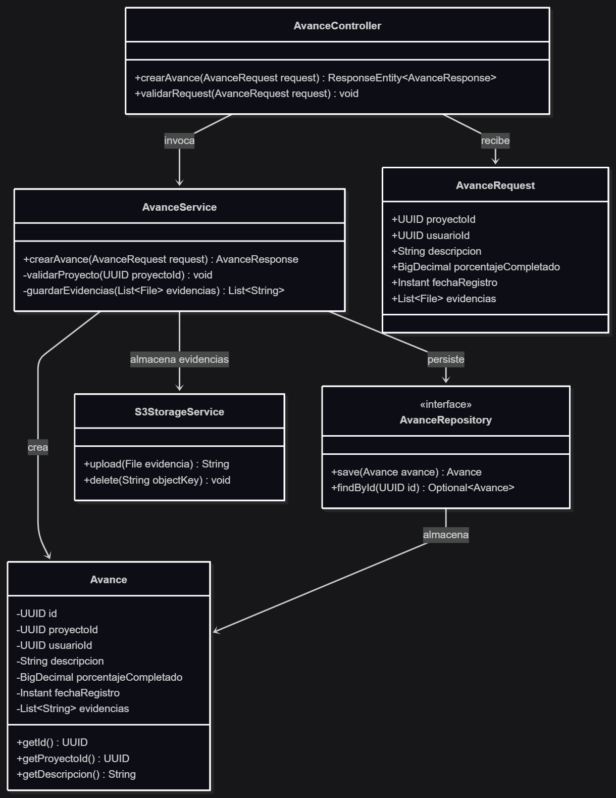

El diseño mantiene la separación por capas ya definida para el backend Spring Boot. `AvanceController` funciona como boundary de la API REST; `AvanceService` concentra la lógica de negocio; `AvanceRepository` encapsula la persistencia en PostgreSQL; `S3StorageService` aísla la comunicación con el almacenamiento de objetos; y `Avance` representa la entidad persistente. Esta separación evita que el controlador conozca detalles de PostgreSQL o S3 y facilita la evolución del componente.

#### 11.1.2 Contratos de interfaz

| Método / Endpoint | Precondición | Postcondición | Excepciones |
|---|---|---|---|
| `POST /api/v1/avances` | Usuario autenticado; `proyectoId`, `descripcion`, `porcentajeCompletado` y `fechaRegistro` válidos. | Se crea un `Avance`, se almacenan sus evidencias y se retorna `201 Created` con el identificador generado. | `400` por datos inválidos; `401` por JWT ausente o inválido; `403` por permisos insuficientes; `502` por fallo de almacenamiento; `503` por indisponibilidad de PostgreSQL. |
| `AvanceService.crearAvance(AvanceRequest): AvanceResponse` | Request validado y usuario autorizado para el proyecto. | El avance queda persistido y las referencias de evidencias quedan asociadas al registro. | `IllegalArgumentException`; `StorageException`; `DataAccessException`. |
| `S3StorageService.upload(File): String` | Archivo válido y servicio de almacenamiento disponible. | Retorna la referencia del objeto almacenado. | `StorageException` por timeout, credenciales inválidas o error del proveedor. |

El endpoint mantiene el contrato previamente documentado para `POST /api/v1/avances`: requiere `Authorization: Bearer <JWT_TOKEN>` y `Content-Type: application/json`, y contempla respuestas `201`, `400`, `401`, `403` y `500/503` según el resultado de la operación.

#### 11.1.3 Análisis de robustez

| Objeto | Tipo (Boundary / Control / Entity) | Responsabilidad |
|---|---|---|
| `AvanceController` | Boundary | Recibir la petición HTTP, validar el payload y traducir el resultado a códigos HTTP. |
| `AvanceRequest` | Boundary / DTO | Transportar los datos recibidos desde la aplicación móvil. |
| `AvanceService` | Control | Coordinar validaciones, almacenamiento de evidencias y persistencia del avance. |
| `S3StorageService` | Control / Adapter | Aislar la integración con el almacenamiento de objetos. |
| `AvanceRepository` | Control / Persistence Gateway | Proporcionar el acceso a PostgreSQL mediante Spring Data JPA. |
| `Avance` | Entity | Mantener el estado persistente del avance y sus referencias a evidencias. |

El diseño contempla tres condiciones de error principales. Si PostgreSQL no está disponible, el backend responde `503` y el cliente conserva el registro para reintento. Si el almacenamiento de evidencias falla, se evita confirmar la operación incompleta y se retorna un error de servicio. Si el payload es inválido, `AvanceController` rechaza la solicitud con `400` antes de acceder a la persistencia.

#### 11.1.4 Diagrama de secuencia — flujo principal detallado

**Figura 6 — Diagrama de flujo en Caso Exitoso de Registro de Avance de Obra.**
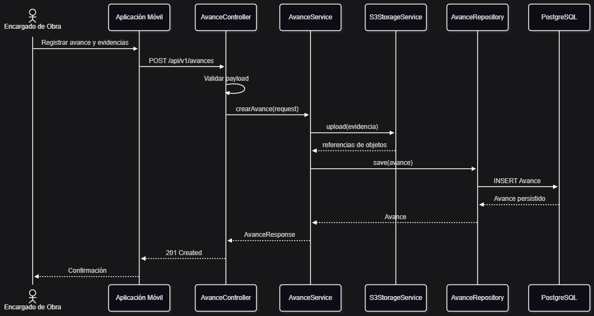

**Camino de error:** si la validación falla, `AvanceController` retorna `400` sin ejecutar persistencia. Si falla PostgreSQL, `AvanceService` no confirma el registro y el cliente mantiene la información para reintentar. Si falla el almacenamiento de evidencias, la operación no se considera exitosa y se devuelve un error de servicio.

**Figura 7 — Diagrama de flujo en Caso de Error de Registro de Avance de Obra.**
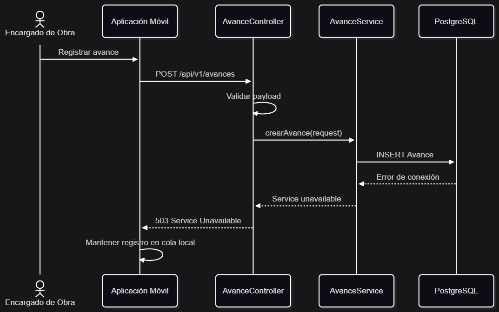

### Componente 2 — Sincronización de Información

**Responsabilidad:** Gestionar el envío diferido de registros generados en campo hacia la API REST cuando se restablece la conectividad, evitando pérdida de información y controlando el estado de sincronización.

**Trazabilidad:** CU1: Registrar avances de obra, CU2: Reportar avances diarios, CU3: Actualizar estado de tareas → Aplicación Móvil / módulo de sincronización, relacionado con la API REST en la vista de estructura interna y con ADR-005.

#### 11.2.1 Diagrama de clases de diseño

**Figura 8 — Diagrama de clases de Sincronización de Información.**
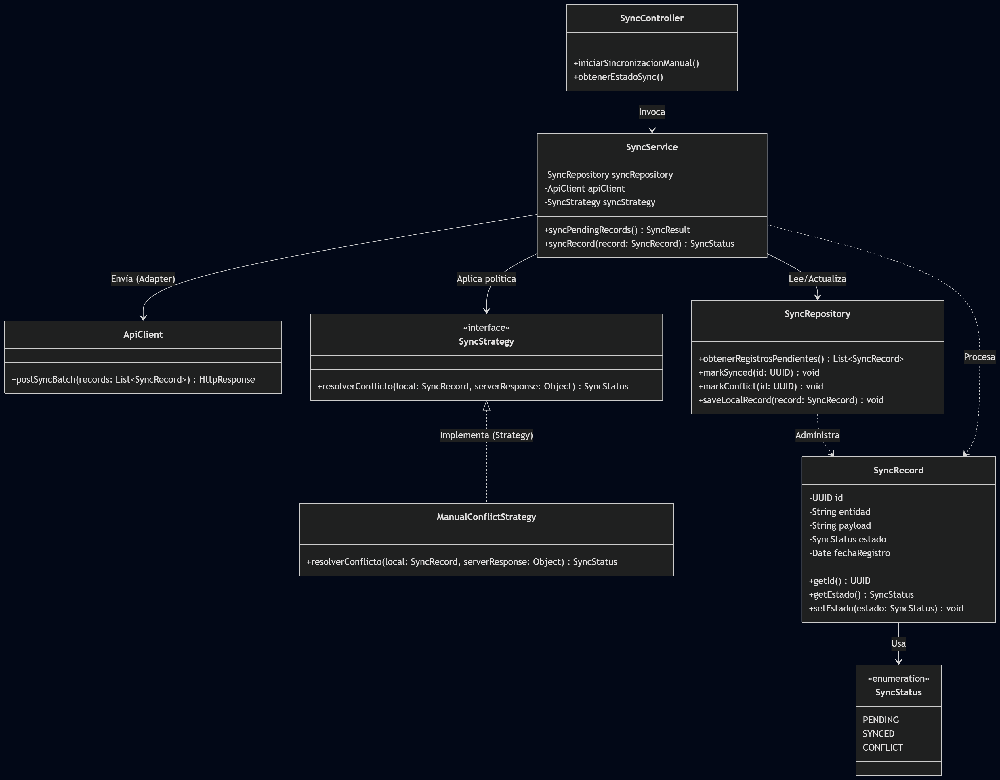

La separación entre `SyncService`, `SyncRepository` y `ApiClient` permite que la lógica de sincronización no dependa directamente del almacenamiento local ni del protocolo HTTP. `SyncStrategy` encapsula la política de resolución de conflictos. La estrategia definida para el alcance actual consiste en detectar el conflicto, conservar la información y marcar el registro como **conflicto pendiente** para resolución manual, tal como establece QS-02.

#### 11.2.2 Contratos de interfaz

| Método / Endpoint | Precondición | Postcondición | Excepciones |
|---|---|---|---|
| `SyncService.syncPendingRecords(): SyncResult` | Existen cero o más registros locales pendientes; la aplicación puede ejecutarse aunque no exista conexión. | Cada registro enviado exitosamente queda marcado como sincronizado; los conflictos quedan marcados como pendientes. | `SyncTransportException`; `AuthenticationException`; `ConflictDetectedException`. |
| `SyncService.syncRecord(SyncRecord): SyncStatus` | Registro local válido y en estado pendiente. | El registro pasa a `SYNCED`, `CONFLICT` o permanece `PENDING` según el resultado. | Error de transporte o respuesta inválida del servidor. |
| `POST /api/v1/sync` | JWT válido y lote de registros correctamente formado. | La API valida y procesa el lote, devolviendo el resultado de cada registro. | `400`, `401`, `409` por conflicto o `503` por indisponibilidad temporal. |
| `SyncRepository.markSynced(UUID): void` | El registro existe y pertenece a la cola local. | El registro queda marcado como sincronizado y no vuelve a enviarse automáticamente. | `IllegalStateException` si el registro no existe o ya fue procesado. |

#### 11.2.3 Análisis de robustez

| Objeto | Tipo (Boundary / Control / Entity) | Responsabilidad |
|---|---|---|
| `SyncController` | Boundary | Iniciar el proceso de sincronización y exponer su resultado al cliente. |
| `SyncService` | Control | Coordinar lectura de pendientes, envío, detección de conflictos y actualización de estados. |
| `ApiClient` | Boundary / Adapter | Comunicar la aplicación móvil con la API REST. |
| `SyncRepository` | Control / Persistence Gateway | Leer y actualizar la cola local de registros pendientes. |
| `SyncStrategy` | Control | Encapsular la política de resolución de conflictos. |
| `SyncRecord` | Entity | Representar un cambio local y su estado de sincronización. |

La robustez se basa en no marcar un registro como sincronizado hasta recibir confirmación del servidor. Ante una interrupción de red, el registro permanece `PENDING`; ante un conflicto, pasa a `CONFLICT` y conserva la trazabilidad para resolución manual. Esto permite mantener la disponibilidad en campo sin sacrificar el control de consistencia.

#### 11.2.4 Diagrama de secuencia — flujo principal

**Figura 9 — Diagrama de flujo de Sincronización de Información caso exitoso.**
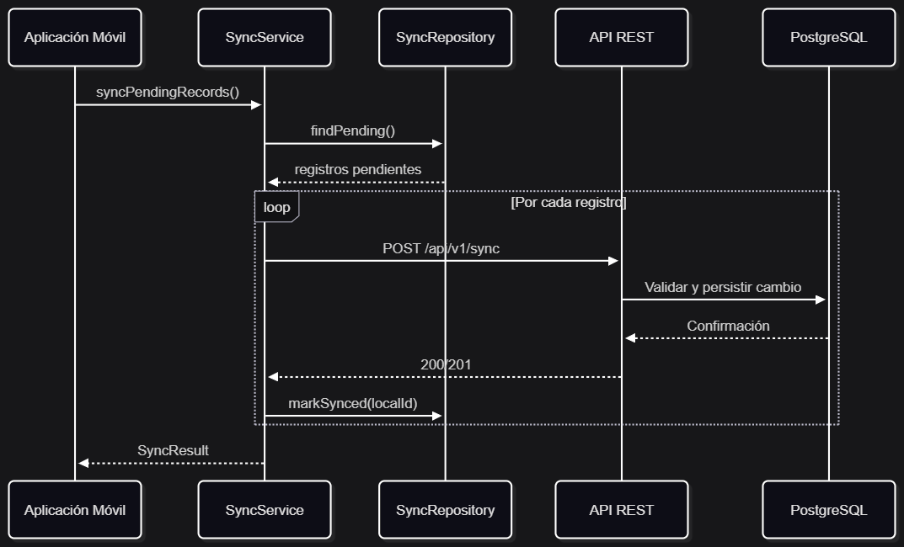

**Camino de error — conflicto:**

**Figura 10 — Diagrama de flujo de Sincronización de Información caso de error.**

### Componente 3 — Autenticación y Autorización

**Responsabilidad:** Autenticar usuarios de la plataforma y controlar el acceso a recursos según el rol asignado, protegiendo las operaciones realizadas desde las aplicaciones web y móvil.

**Trazabilidad:** CU1: Registrar avances de obra, CU3: Supervisar tareas, CU5: Solicitar materiales, además de los casos de uso administrativos que requieren acceso según rol → API REST / módulo de autenticación y autorización, relacionado con ADR-006.

#### 11.3.1 Diagrama de clases de diseño

**Figura 11 — Diagrama de clases de diseño del componente Autenticación y Autorización.**
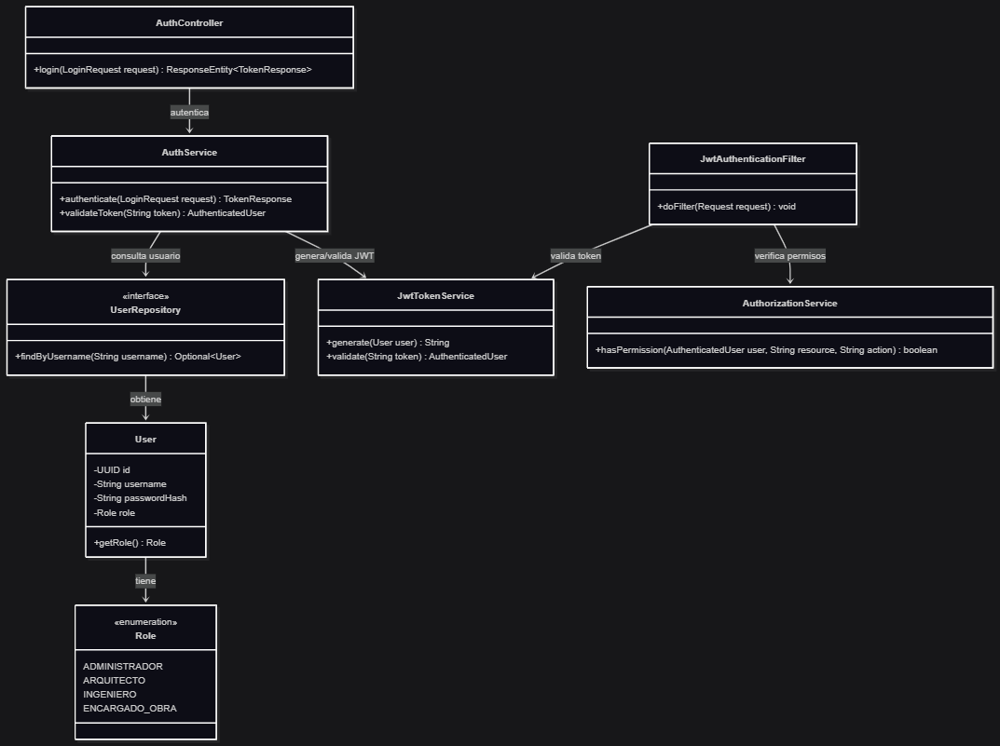

El componente aplica la decisión documentada en ADR-006: JWT para autenticación sin estado y RBAC para autorización. `AuthController` recibe las credenciales; `AuthService` coordina la autenticación; `JwtTokenService` administra la emisión y validación del token; `JwtAuthenticationFilter` intercepta las solicitudes protegidas; y `AuthorizationService` verifica que el rol del usuario tenga permiso sobre el recurso solicitado.

#### 11.3.2 Contratos de interfaz

| Método / Endpoint | Precondición | Postcondición | Excepciones |
|---|---|---|---|
| `POST /api/v1/auth/login` | Usuario registrado y credenciales recibidas en formato válido. | Se retorna un JWT válido y la información básica del usuario autenticado. | `400` por request inválido; `401` por credenciales incorrectas. |
| `AuthService.authenticate(LoginRequest): TokenResponse` | Username y contraseña presentes. | Usuario autenticado y token JWT generado con su rol. | `AuthenticationException` si las credenciales no son válidas. |
| `JwtTokenService.validate(String): AuthenticatedUser` | Token con estructura válida. | Retorna identidad y rol si el token es válido y no ha expirado. | `InvalidTokenException` por token inválido o expirado. |
| `AuthorizationService.hasPermission(User, String, String): boolean` | Usuario autenticado y recurso identificado. | Retorna `true` únicamente cuando el rol permite ejecutar la acción solicitada. | `AccessDeniedException` cuando la política rechaza la operación. |

#### 11.3.3 Análisis de robustez

| Objeto | Tipo (Boundary / Control / Entity) | Responsabilidad |
|---|---|---|
| `AuthController` | Boundary | Recibir las credenciales y devolver la respuesta HTTP correspondiente. |
| `JwtAuthenticationFilter` | Boundary | Interceptar solicitudes protegidas y extraer el JWT. |
| `AuthService` | Control | Coordinar búsqueda del usuario, validación de credenciales y generación del token. |
| `JwtTokenService` | Control | Crear y validar tokens JWT. |
| `AuthorizationService` | Control | Aplicar las reglas RBAC para autorizar acciones. |
| `UserRepository` | Control / Persistence Gateway | Recuperar información de usuarios desde PostgreSQL. |
| `User` | Entity | Representar al usuario y su rol persistente. |

El componente rechaza solicitudes sin credenciales válidas antes de ejecutar operaciones protegidas. Un token inválido o expirado genera `401`; un usuario autenticado pero sin permisos suficientes genera `403`. Esta separación permite distinguir autenticación de autorización y mantiene las reglas de acceso centralizadas en el backend.

#### 11.3.4 Diagrama de secuencia — flujo principal

**Figura 12 — Diagrama de clases de diseño del componente Autenticación y Autorización.**
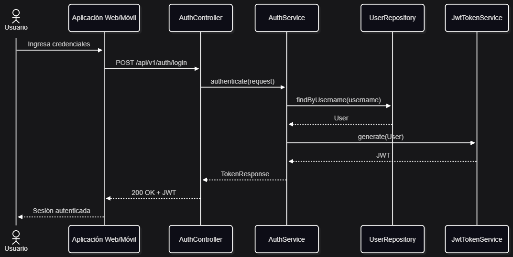

**Camino de error — token inválido:**

**Figura 13 — Diagrama de clases de diseño del componente Autenticación y Autorización.**
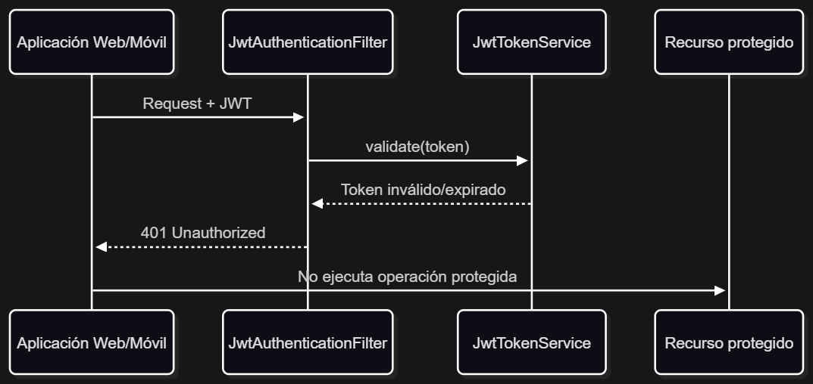

---

## 12. Patrones de diseño aplicados

Los patrones seleccionados se aplican sobre problemas concretos identificados en el diseño. No se utilizan como elementos decorativos: cada uno reduce un acoplamiento o encapsula una decisión que podría cambiar con la evolución del sistema.

### Patrón 1 — Adapter

| Campo | Detalle |
|---|---|
| **Categoría** | Estructural |
| **Ubicación en el sistema** | `S3StorageService`, dentro del componente Registro de Avance de Obra (sección 11.1). |
| **Problema que resuelve** | El módulo de avances necesita almacenar fotografías en un servicio externo compatible con S3 sin acoplar la lógica de negocio a la API concreta del proveedor. |
| **Alternativa considerada** | Invocar directamente el SDK de Amazon S3 desde `AvanceService`. |
| **Por qué el patrón y no la alternativa** | El adaptador concentra la dependencia externa en una sola clase. Así, `AvanceService` trabaja con una interfaz estable y el proveedor puede sustituirse o modificarse sin alterar la lógica principal del registro de avances. |

**Figura 14 — Aplicación del patrón Adapter para el almacenamiento de evidencias.**
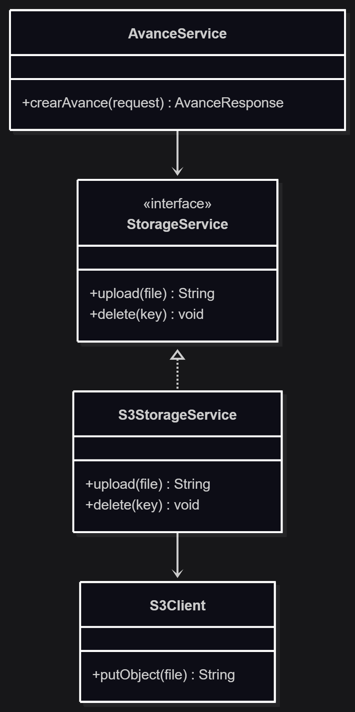

### Patrón 2 — Repository

| Campo | Detalle |
|---|---|
| **Categoría** | Estructural / Persistencia |
| **Ubicación en el sistema** | `AvanceRepository` y `SyncRepository`, en los componentes Registro de Avance y Sincronización. |
| **Problema que resuelve** | Separar la lógica de negocio del acceso directo a PostgreSQL y del detalle de persistencia utilizado por Spring Data JPA. |
| **Alternativa considerada** | Ejecutar consultas SQL o llamadas JPA directamente desde los servicios de negocio. |
| **Por qué el patrón y no la alternativa** | El repositorio establece una frontera clara para la persistencia. Esto reduce el acoplamiento entre servicios y tecnología de almacenamiento y facilita pruebas y cambios futuros del mecanismo de acceso a datos. |

**Figura 15 — Aplicación del patrón Repository para la persistencia.**
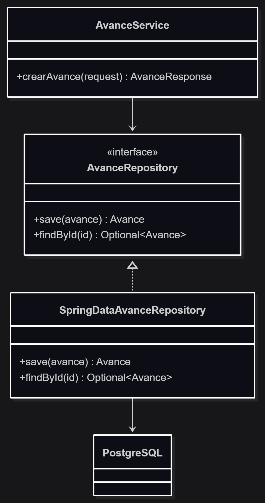

### Patrón 3 — Strategy

| Campo | Detalle |
|---|---|
| **Categoría** | Comportamiento |
| **Ubicación en el sistema** | `SyncStrategy` dentro del componente Sincronización de Información (sección 11.2). |
| **Problema que resuelve** | La sincronización puede requerir diferentes políticas de resolución cuando el registro local y el registro del servidor presentan cambios incompatibles. |
| **Alternativa considerada** | Colocar toda la lógica de resolución mediante condicionales dentro de `SyncService`. |
| **Por qué el patrón y no la alternativa** | Strategy permite encapsular la política de resolución y cambiarla sin modificar el flujo principal de sincronización. Para el alcance actual se utiliza `ManualConflictStrategy`, que marca el conflicto como pendiente y conserva la trazabilidad. |

**Figura 16 — Aplicación del patrón Strategy para la política de resolución de conflictos.**
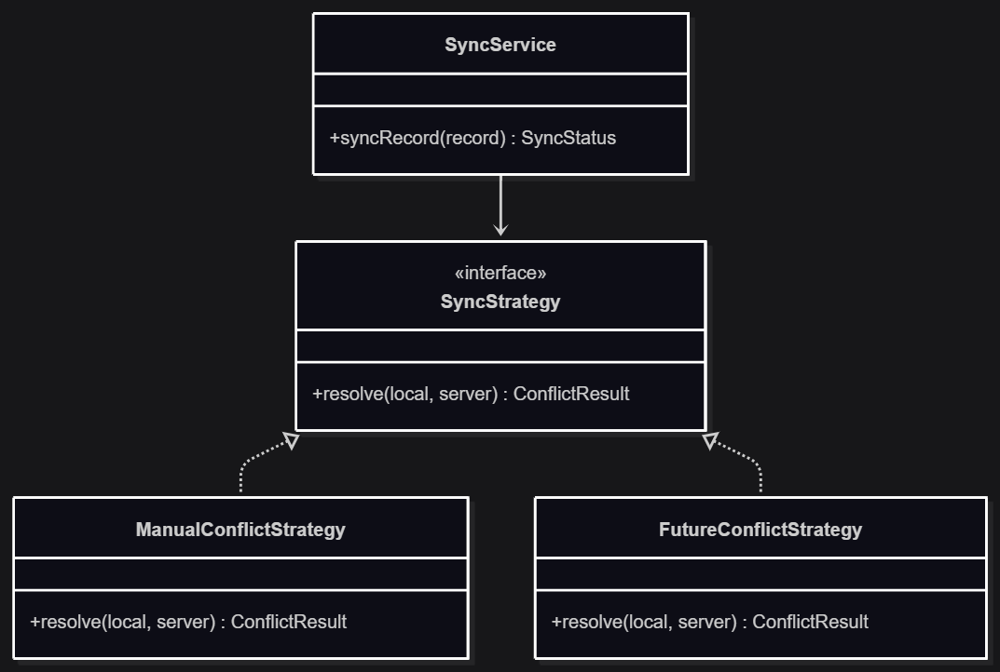

---

## 13. Principios y Técnicas Habilitadoras — Evidencia

El diseño de la solución se fundamenta en los principios **SOLID** y técnicas arquitectónicas orientadas a la mantenibilidad y resiliencia.

| Principio | Evidencia específica en el diseño | Tensión con otro principio |
| :--- | :--- | :--- |
| **Single Responsibility (SRP)** | En la **Figura 5**, `AvanceController` se encarga exclusivamente de la capa HTTP, mientras que `AvanceService` maneja la regla de negocio y `S3StorageService` la transferencia de archivos. | Aumenta la cantidad de clases, tensionando con la simplicidad (KISS). |
| **Open/Closed (OCP)** | En la **Figura 8**, el motor de sincronización (`SyncService`) está abierto a extensión mediante la interfaz `SyncStrategy`, permitiendo agregar nuevas políticas (ej. *AutoResolveStrategy*) sin modificar la clase base. | Incrementa la abstracción frente al uso de simples condicionales. |
| **Liskov Substitution (LSP)** & **Interface Segregation (ISP)** | En la **Figura 14**, el componente de avances depende de la interfaz general `StorageService`. Cualquier implementación (como `S3StorageService`) puede sustituirla sin alterar el contrato de la interfaz, la cual es pequeña y enfocada (solo contiene el método `upload`). | Ninguna significativa; mejora directamente la cohesión. |
| **Dependency Inversion (DIP)** | En la **Figura 15**, `AvanceService` (alto nivel) no depende directamente de PostgreSQL (bajo nivel), sino de la abstracción `AvanceRepository`. | Requiere configuración de inyección de dependencias en el framework (Spring). |
| **Separación de Responsabilidades (SoC) / DRY** | Centralización de la validación de tokens en `JwtAuthenticationFilter` (**Figura 11**), evitando duplicar código de seguridad en cada controlador de la API. | La centralización crea dependencia de la API (Single Point of Failure). |
| **Diseño orientado a la resiliencia** | La cola local (`SyncRepository`, **Figura 8**) mantiene operaciones en estado `PENDING` hasta recibir el *200 OK* del servidor, protegiendo contra pérdida de datos. | Tensión con la consistencia inmediata (QS-02), aceptada para favorecer la disponibilidad (QS-01). |

### Trazabilidad resumida del diseño

| Caso de uso / driver | Componente | Patrón / decisión relacionada | Atributo de calidad |
|---|---|---|---|
| CU1 Registrar avances de obra | Registro de Avance | Adapter, Repository, ADR-004 | Consistencia, trazabilidad, seguridad |
| CU4 Adjuntar evidencia fotográfica | Registro de Avance | Adapter, ADR-004 | Resiliencia, trazabilidad |
| CU1 / CU2 Registrar avances en campo | Sincronización | Strategy, ADR-005 | Disponibilidad, consistencia |
| CU3 Supervisar tareas | Autenticación y Autorización | JWT + RBAC, ADR-006 | Seguridad, trazabilidad |
| Operación con conectividad intermitente | Sincronización | Cola local + sincronización diferida | Disponibilidad, resiliencia |

El diseño detallado mantiene la relación entre los casos de uso, los componentes de la vista de estructura interna, los escenarios de calidad y las decisiones arquitectónicas. De esta forma, el Bloque 5 no introduce componentes aislados, sino que concreta las decisiones tomadas previamente para resolver el problema central de operación en campo, sincronización, consistencia, manejo de evidencias y control de acceso.

## 14. Análisis de calidad del diseño

El análisis de calidad permite validar que las decisiones arquitectónicas y el diseño detallado responden a los escenarios de calidad definidos para el sistema. Para esta evaluación se consideran los escenarios QS-01 a QS-05, los componentes críticos diseñados y los ADR relacionados.

### 14.1 Validación de escenarios de calidad

| Escenario | Validación del diseño | Evidencia |
|---|---|---|
| **QS-01 — Disponibilidad** | El diseño permite que la aplicación móvil continúe registrando información cuando no existe conectividad. Los registros se almacenan localmente y quedan pendientes de sincronización hasta que se restablece la conexión. | Componente **Sincronización de Información**, `SyncRepository`, estados `PENDING` / `SYNCED` y ADR-005. |
| **QS-02 — Consistencia** | El diseño contempla la detección de conflictos durante la sincronización. Los registros que presentan modificaciones incompatibles se mantienen como `CONFLICT` para resolución posterior, evitando sobrescribir información automáticamente. | `SyncService`, `SyncStrategy`, `ManualConflictStrategy` y ADR-005. |
| **QS-03 — Trazabilidad** | La información de las operaciones se mantiene centralizada en el backend y en PostgreSQL, permitiendo consultar los registros y asociarlos con las operaciones realizadas. | PostgreSQL, API REST, `Repository` y los componentes de negocio definidos en la sección 11. |
| **QS-04 — Seguridad** | El acceso a los recursos protegidos requiere autenticación mediante JWT y posteriormente una validación de permisos basada en roles. Las solicitudes no autorizadas son rechazadas antes de ejecutar la operación protegida. | Componente **Autenticación y Autorización**, `JwtAuthenticationFilter`, `JwtTokenService`, `AuthorizationService` y ADR-006. |
| **QS-05 — Resiliencia** | Las operaciones relacionadas con evidencias fotográficas se desacoplan del almacenamiento transaccional. Además, la sincronización diferida permite conservar operaciones pendientes cuando se interrumpe la conectividad. | `S3StorageService`, patrón Adapter, almacenamiento de objetos, componente de Sincronización y ADR-004 / ADR-005. |

El diseño proporciona mecanismos específicos para responder a los escenarios de calidad definidos. Sin embargo, las métricas cuantitativas establecidas en los escenarios deberán comprobarse mediante pruebas durante la implementación. Por lo tanto, esta sección valida que el diseño contiene los mecanismos necesarios, pero no pretende sustituir la evidencia obtenida mediante pruebas de rendimiento, disponibilidad o seguridad.

### 14.2 Trade-offs entre atributos de calidad

Las decisiones arquitectónicas implican compromisos entre diferentes atributos de calidad. En particular, la necesidad de soportar operación offline genera una tensión entre disponibilidad y consistencia, mientras que la incorporación de mecanismos de seguridad y abstracciones adicionales genera compromisos entre seguridad, mantenibilidad, simplicidad y rendimiento.

| Trade-off | Decisión adoptada | Justificación |
|---|---|---|
| **Disponibilidad vs. consistencia inmediata** | Se prioriza la disponibilidad mediante operación offline y sincronización diferida. | Los usuarios deben poder registrar información en campo aun cuando no exista conexión. La consistencia se recupera posteriormente mediante sincronización y detección de conflictos. |
| **Disponibilidad vs. resolución inmediata de conflictos** | Los conflictos se marcan como `CONFLICT` para resolución posterior. | Resolver automáticamente un conflicto podría producir una pérdida o sobrescritura incorrecta de información. Se prioriza conservar los datos y mantener la trazabilidad. |
| **Mantenibilidad vs. simplicidad** | Se utilizan `Repository`, `Adapter` y `Strategy` en puntos donde existe una variabilidad real. | Estas abstracciones agregan clases e interfaces, pero permiten aislar dependencias externas y políticas que pueden cambiar durante la evolución del sistema. |
| **Seguridad vs. rendimiento** | Se aplican autenticación JWT y autorización RBAC en las operaciones protegidas. | Las validaciones adicionales introducen procesamiento, pero son necesarias para cumplir los requisitos de seguridad y control de acceso. |
| **Simplicidad vs. resiliencia** | Se incorpora una cola local para los registros pendientes de sincronización. | La cola agrega complejidad al cliente móvil, pero permite mantener la operación durante períodos sin conectividad y reducir el riesgo de pérdida de información. |
| **Base de datos vs. almacenamiento de objetos** | Las fotografías se almacenan mediante un servicio de objetos separado de PostgreSQL. | Esto evita utilizar la base de datos transaccional como almacenamiento principal de archivos multimedia y permite separar las necesidades de persistencia estructurada de las evidencias fotográficas. |

Los trade-offs anteriores son coherentes con la decisión general de mantener una arquitectura monolítica modular. Se evita introducir complejidad innecesaria, pero se mantienen abstracciones en los puntos donde aportan beneficios claros para los atributos de calidad prioritarios.

### 14.3 Métricas estimadas de cohesión y acoplamiento

La evaluación de cohesión y acoplamiento se realiza sobre los tres componentes críticos definidos en la sección 11. Debido a que el proyecto se encuentra en etapa de diseño, estas métricas se presentan como una evaluación cualitativa y deberán complementarse con métricas obtenidas durante la implementación.

| Componente | Cohesión estimada | Acoplamiento estimado | Justificación |
|---|---|---|---|
| **Registro de Avance de Obra** | Alta | Medio | Las responsabilidades están concentradas en el registro de avances y la asociación de evidencias. Las dependencias hacia PostgreSQL y el almacenamiento de objetos están aisladas mediante `AvanceRepository` y `S3StorageService`. |
| **Sincronización de Información** | Alta | Medio | `SyncService` coordina la sincronización, mientras `SyncRepository`, `ApiClient` y `SyncStrategy` mantienen responsabilidades diferenciadas. Existen dependencias hacia almacenamiento local y API REST, pero se encuentran encapsuladas. |
| **Autenticación y Autorización** | Alta | Medio | La autenticación, validación de tokens y autorización están separadas entre `AuthService`, `JwtTokenService`, `JwtAuthenticationFilter` y `AuthorizationService`. La dependencia hacia usuarios persistidos se mantiene mediante `UserRepository`. |

En los tres componentes se busca mantener alta cohesión, agrupando responsabilidades relacionadas dentro de cada componente, y acoplamiento moderado, aislando dependencias externas mediante interfaces y patrones de diseño.

Esta evaluación también evidencia la aplicación de los principios de Separación de Responsabilidades, Alta Cohesión y Bajo Acoplamiento y Diseño para el Cambio, documentados anteriormente. Los patrones Repository, Adapter y Strategy contribuyen directamente a limitar el impacto de cambios en persistencia, almacenamiento externo y políticas de sincronización.

## Secciones específicas por tipo de sistema

### 15.1 Sistemas distribuidos / cloud

La plataforma presenta características de un sistema distribuido debido a la interacción entre la aplicación web, la aplicación móvil, la API REST, PostgreSQL y el servicio de almacenamiento de objetos. Además, la aplicación móvil debe continuar funcionando durante períodos de conectividad intermitente, por lo que el diseño incorpora mecanismos de almacenamiento local y sincronización diferida.

#### Estrategia de consistencia

El sistema utiliza una estrategia de consistencia eventual para la información registrada desde los dispositivos móviles.

Cuando un usuario registra información mientras se encuentra sin conexión, los datos se almacenan localmente y permanecen en estado `PENDING`. Cuando se recupera la conectividad, el cliente intenta sincronizar los registros con la API REST. Una vez que el servidor confirma correctamente la operación, el registro pasa a estado `SYNCED`.

Cuando se detectan modificaciones incompatibles entre la información local y la información existente en el servidor, el registro se marca como `CONFLICT` y se mantiene pendiente de resolución. Para este comportamiento se utiliza `SyncStrategy`, con `ManualConflictStrategy` como estrategia de resolución definida actualmente.

La consistencia eventual se considera adecuada para el dominio porque los usuarios pueden trabajar en obras con conectividad limitada o intermitente. Priorizar una consistencia inmediata impediría que los usuarios continúen registrando avances cuando no existe conexión.

#### Modelo CAP aplicado

El sistema favorece un modelo AP (Availability + Partition Tolerance) para las operaciones realizadas desde los dispositivos móviles.

La tolerancia a particiones es necesaria debido a que la comunicación entre la aplicación móvil y el backend puede interrumpirse temporalmente. Ante esta situación, la aplicación continúa permitiendo el registro de información mediante almacenamiento local.

La disponibilidad se prioriza porque los encargados de obra deben poder continuar registrando avances y evidencias aun cuando no tengan conexión con el servidor.

Como consecuencia, durante una partición no se garantiza la consistencia inmediata entre el dispositivo y el servidor. Esta consistencia se recupera posteriormente mediante el proceso de sincronización y la detección de conflictos.

Esta decisión está directamente relacionada con **QS-01 Disponibilidad** y **QS-02 Consistencia**, además de la decisión documentada en **ADR-005 — Operación offline y sincronización diferida**.

#### Manejo de fallos y resiliencia

La resiliencia del sistema se basa principalmente en conservar las operaciones pendientes cuando existen interrupciones de conectividad y procesarlas posteriormente.

| Mecanismo | Aplicación | Propósito |
|---|---|---|
| **Almacenamiento local** | Aplicación móvil | Permitir registrar información durante períodos sin conectividad. |
| **Cola de sincronización** | Módulo de sincronización | Mantener operaciones pendientes hasta que puedan enviarse al servidor. |
| **Estados `PENDING`, `SYNCED` y `CONFLICT`** | Registros sincronizables | Representar explícitamente el estado de cada operación y evitar confirmar operaciones que todavía no han sido sincronizadas. |
| **Reintento de sincronización** | `SyncService` / `ApiClient` | Intentar nuevamente el envío de operaciones pendientes después de una interrupción de conectividad. |
| **Detección de conflictos** | `SyncService` / `SyncStrategy` | Evitar que una sincronización sobrescriba automáticamente información incompatible. |
| **Resolución manual** | `ManualConflictStrategy` | Mantener el conflicto pendiente para que pueda ser revisado y resuelto posteriormente. |
| **Almacenamiento de objetos** | `S3StorageService` | Separar el almacenamiento de evidencias fotográficas de los datos transaccionales de PostgreSQL. |

El diseño actual no define un Circuit Breaker como componente explícito, por lo que no se considera una decisión arquitectónica adoptada. De igual manera, los valores concretos de `timeout` y las políticas de reintento deberán definirse durante la implementación. Esto evita presentar como implementados mecanismos que todavía no forman parte del diseño documentado.

Los fallos de conectividad se manejan principalmente mediante la persistencia local y la sincronización posterior. Si una operación no puede completarse con el servidor, permanece pendiente en lugar de considerarse exitosa.

#### Modelo de despliegue en nube

El sistema propone un modelo de despliegue centralizado basado en un monolito modular, acompañado por servicios especializados de persistencia y almacenamiento.

La arquitectura está compuesta por los siguientes elementos:

| Elemento | Responsabilidad |
|---|---|
| **Aplicación web** | Interfaz utilizada por los usuarios administrativos y de supervisión. |
| **Aplicación móvil** | Permite registrar información en campo y trabajar temporalmente sin conexión. |
| **API REST / Backend** | Centraliza la lógica de negocio, autenticación, autorización y operaciones de los clientes. |
| **PostgreSQL** | Almacena la información estructurada y transaccional del sistema. |
| **Almacenamiento de objetos compatible con S3** | Almacena fotografías y otras evidencias asociadas a los avances de obra. |

La aplicación web y la aplicación móvil se comunican con el backend mediante HTTPS/REST. El backend centraliza las reglas de negocio y utiliza PostgreSQL para la información estructurada.

Las fotografías no se almacenan directamente como datos transaccionales dentro de PostgreSQL. En su lugar, se utiliza un servicio de almacenamiento de objetos compatible con S3, encapsulado mediante `S3StorageService` y el patrón Adapter.

Este modelo permite mantener una arquitectura relativamente sencilla para el tamaño actual del sistema, evitando introducir microservicios sin una necesidad demostrada. Al mismo tiempo, la separación entre lógica de negocio, persistencia y almacenamiento de evidencias permite evolucionar la solución posteriormente si aumentan la cantidad de usuarios, proyectos o carga del sistema.

### 15.2 Sistemas concurrentes / tiempo real

El sistema no corresponde a un sistema de tiempo real estricto, ya que no existen restricciones de respuesta deterministas asociadas a procesos físicos o críticos. Sin embargo, presenta situaciones de concurrencia relacionadas principalmente con la sincronización de información entre dispositivos móviles y el backend.

#### Modelo de concurrencia

El modelo utilizado se basa principalmente en operaciones asincrónicas de sincronización entre el cliente móvil y el backend.

La aplicación móvil puede continuar registrando información localmente mientras no existe conectividad. Posteriormente, cuando se recupera la conexión, el módulo de sincronización procesa las operaciones pendientes y las envía al backend mediante la API REST.

El sistema no utiliza un modelo basado en múltiples hilos administrados directamente por la lógica de negocio ni un modelo de actores. La concurrencia relevante se produce principalmente por la posibilidad de que diferentes clientes realicen operaciones sobre información relacionada antes de que todos los cambios hayan sido sincronizados.

Por esta razón, el diseño se enfoca principalmente en detectar y manejar conflictos de datos, en lugar de utilizar mecanismos de exclusión mutua entre usuarios.

#### Recursos compartidos y sincronización

Los principales recursos compartidos son los registros de información de los proyectos que pueden ser modificados desde diferentes dispositivos o desde la aplicación web.

| Recurso compartido | Mecanismo de sincronización | Riesgo de condición de carrera | Mitigación |
|---|---|---|---|
| **Registros de avance de obra** | Sincronización mediante API REST y control de estados `PENDING`, `SYNCED` y `CONFLICT`. | Sí — dos dispositivos podrían modificar información relacionada antes de sincronizar sus cambios. | Detección de conflictos mediante `SyncService` y aplicación de `SyncStrategy`. Los conflictos se mantienen como `CONFLICT` para resolución posterior. |
| **Información registrada offline** | Cola local de sincronización. | Sí — una misma operación podría intentar sincronizarse nuevamente después de una interrupción. | El estado del registro permite identificar operaciones pendientes y evitar considerarlas sincronizadas hasta recibir confirmación del servidor. |
| **Evidencias fotográficas** | Sincronización de archivos mediante el servicio de almacenamiento de objetos. | Sí — pueden existir intentos de transferencia repetidos o interrupciones durante el envío. | El estado de la operación se mantiene hasta confirmar correctamente la transferencia. El almacenamiento se encuentra desacoplado mediante `S3StorageService`. |
| **Datos persistidos en PostgreSQL** | Control transaccional de la persistencia del backend. | Sí — diferentes solicitudes pueden intentar modificar información relacionada de manera concurrente. | La persistencia se centraliza en PostgreSQL y el acceso se encapsula mediante los componentes Repository definidos en el diseño. |

#### Manejo de condiciones de carrera

El principal riesgo de concurrencia se presenta cuando dos clientes trabajan sobre información relacionada sin conocer los cambios realizados por el otro cliente.

El diseño utiliza una estrategia de detección y resolución posterior. Cuando la sincronización identifica una incompatibilidad, el registro no se sobrescribe automáticamente, sino que pasa al estado `CONFLICT`.

Este enfoque permite mantener la disponibilidad del sistema sin sacrificar la trazabilidad de los cambios. La resolución mediante `ManualConflictStrategy` evita que el sistema tome automáticamente una decisión que pueda provocar pérdida de información.

No se identifican actualmente condiciones que requieran el uso explícito de mutex, semáforos u otros mecanismos de exclusión mutua a nivel de la lógica de negocio. La coordinación de las operaciones se realiza mediante los estados de sincronización, las transacciones de persistencia y la detección de conflictos.

### 15.3 Sistemas con seguridad crítica

La seguridad es un aspecto relevante del sistema debido a que la plataforma administra información de proyectos de construcción, usuarios, avances de obra, evidencias fotográficas y datos asociados a diferentes roles. El diseño incorpora controles de autenticación, autorización y protección de las comunicaciones para reducir los riesgos de acceso no autorizado y modificación indebida de la información.

#### Modelo de amenazas

| Amenaza | Componente en riesgo | Mitigación en el diseño |
|---|---|---|
| Spoofing | API REST, usuarios y sesiones | Autenticación mediante JWT y validación del token antes de permitir el acceso a recursos protegidos. |
| Tampering | API REST, registros de proyectos y avances | Validación de solicitudes, autorización basada en roles y persistencia centralizada en PostgreSQL. |
| Repudiation | Operaciones realizadas sobre proyectos | Asociación de las operaciones con el usuario autenticado y conservación de la información necesaria para mantener la trazabilidad. |
| Information Disclosure | API REST, PostgreSQL y almacenamiento de objetos | Control de acceso mediante RBAC, autenticación obligatoria y separación entre datos transaccionales y evidencias almacenadas como objetos. |
| Denial of Service | API REST y servicios del backend | Validación de solicitudes y separación de responsabilidades para evitar que errores de clientes afecten directamente la persistencia. Los mecanismos específicos de rate limiting o protección ante ataques volumétricos quedan fuera del diseño actual. |
| Elevation of Privilege | API REST y funcionalidades según rol | `AuthorizationService` valida los permisos asociados al rol antes de permitir operaciones protegidas. Los usuarios no autorizados reciben una respuesta de acceso denegado. |

#### Controles por capa

| Capa | Controles de seguridad |
|---|---|
| Cliente web y móvil | Autenticación del usuario y envío de solicitudes mediante HTTPS. |
| Comunicación | Uso de HTTPS para proteger la comunicación entre los clientes y la API REST. |
| API / Backend | `JwtAuthenticationFilter` valida las credenciales incluidas en las solicitudes protegidas antes de permitir el acceso. |
| Autenticación | `JwtTokenService` gestiona la validación de los tokens JWT utilizados para identificar al usuario. |
| Autorización | `AuthorizationService` verifica los permisos asociados al rol del usuario antes de ejecutar operaciones protegidas. |
| Lógica de negocio | Las operaciones se ejecutan después de superar los controles de autenticación y autorización correspondientes. |
| Persistencia | PostgreSQL centraliza la información estructurada y el acceso se realiza mediante los componentes Repository definidos en el diseño. |
| Almacenamiento de evidencias | Las fotografías se mantienen separadas de la información transaccional mediante un servicio de almacenamiento de objetos encapsulado por `S3StorageService`. |

El modelo de seguridad sigue un enfoque de defensa por capas: la autenticación determina quién realiza la solicitud y la autorización determina si dicho usuario puede ejecutar la operación solicitada.

La decisión de utilizar JWT y RBAC se encuentra documentada en el ADR-006. El diseño actual proporciona los controles necesarios para el alcance definido; mecanismos adicionales como autenticación multifactor, rate limiting, detección avanzada de intrusiones o gestión centralizada de secretos podrían incorporarse como parte de una evolución posterior de la plataforma.

## 16. Tendencias y evolución del diseño

La evolución de la arquitectura se plantea de forma incremental, considerando las necesidades actuales del sistema y evitando introducir complejidad que no aporte valor al alcance definido. Las posibles tecnologías y estilos arquitectónicos futuros se consideran como puntos de evolución y no como requisitos actuales.

### 16.1 Tendencias arquitectónicas consideradas

| Tendencia | Postura | Justificación |
|---|---|---|
| Microservicios | No adoptada actualmente | El sistema tiene un alcance y una escala que no justifican la complejidad operacional de múltiples servicios independientes. Se mantiene un monolito modular que permite separar responsabilidades sin introducir costos adicionales de despliegue y operación. |
| Cloud-native | Adopción parcial | El diseño contempla servicios desacoplados para persistencia y almacenamiento de evidencias, además de clientes que consumen una API REST. Sin embargo, no se plantea actualmente una arquitectura completamente basada en microservicios o servicios distribuidos independientes. |
| Diseño dirigido por el dominio (DDD) | Adopción parcial | La solución separa responsabilidades relacionadas con avances de obra, sincronización, autenticación, inventario, compras y cronogramas. No se considera necesario aplicar todos los patrones tácticos y estratégicos de DDD para el alcance actual. |
| Arquitectura orientada a eventos | Posible evolución | Podría utilizarse posteriormente para procesar de forma asíncrona eventos como cambios de estado, sincronizaciones, notificaciones o generación de reportes. Actualmente REST resulta suficiente para las necesidades identificadas. |
| IA generativa / agentes | No adoptada actualmente | No existe un requerimiento actual que justifique incorporar IA generativa. Una futura incorporación tendría que evaluarse considerando seguridad, trazabilidad, calidad de las respuestas y protección de la información de los proyectos. |
| Observabilidad | Posible evolución | Una versión futura podría incorporar métricas, logs centralizados, trazas y monitoreo de los componentes para facilitar la detección de problemas y evaluar los escenarios de calidad en producción. |

### 16.2 Evolución hacia microservicios

La arquitectura actual utiliza un monolito modular como decisión consciente. Los módulos mantienen responsabilidades separadas y límites claros, permitiendo evolucionar posteriormente aquellos componentes que presenten mayores necesidades de escalabilidad o independencia.

La migración hacia microservicios no se considera necesaria para la primera versión debido a que introduciría complejidad adicional en despliegue, comunicación, monitoreo y manejo de fallos.

Sin embargo, la separación actual permite identificar posibles candidatos para una futura extracción. Entre ellos se encuentran el módulo de sincronización, el procesamiento de evidencias y determinados servicios relacionados con autenticación o notificaciones.

La decisión de mantener el monolito modular está alineada con el ADR-001 y con el principio KISS adoptado en el diseño.

### 16.3 Puntos de extensión futuros

| Punto de extensión | Evolución posible | Elemento actual que lo habilita |
|---|---|---|
| Sincronización | Incorporar nuevas estrategias automáticas de resolución de conflictos. | `SyncStrategy` y `ManualConflictStrategy`. |
| Almacenamiento de evidencias | Cambiar el proveedor de almacenamiento o incorporar procesamiento adicional de fotografías. | `StorageService` y `S3StorageService`. |
| Persistencia | Sustituir o complementar el mecanismo de persistencia utilizado por el backend. | Interfaces `Repository` y separación entre lógica de negocio y persistencia. |
| Autorización | Evolucionar desde RBAC hacia permisos más granulares. | `AuthorizationService` y separación entre autenticación y autorización. |
| API | Incorporar nuevos clientes o integraciones externas. | API REST como punto central de comunicación con el backend. |
| Notificaciones | Incorporar notificaciones push, correo u otros canales. | Arquitectura modular y separación de responsabilidades. |
| Procesamiento asíncrono | Incorporar colas o eventos para tareas de larga duración. | Separación entre componentes y posibilidad de introducir procesamiento asincrónico sin modificar directamente la lógica principal. |
| Observabilidad | Incorporar métricas, logs centralizados y trazabilidad técnica. | Arquitectura modular y centralización de las operaciones en el backend. |
| Escalabilidad | Extraer módulos específicos hacia servicios independientes. | Límites modulares definidos en el monolito actual. |

### 16.4 Criterios para la evolución

La evolución de la arquitectura deberá basarse en necesidades observables y no únicamente en la adopción de nuevas tecnologías. Antes de introducir un cambio arquitectónico se deberán considerar al menos los siguientes criterios:

1. Incremento significativo de usuarios o proyectos administrados.
2. Necesidad de escalar componentes de manera independiente.
3. Aparición de nuevos requerimientos de disponibilidad o rendimiento.
4. Aumento de la complejidad de la sincronización y procesamiento de información.
5. Necesidad de integrar nuevos sistemas o servicios externos.
6. Cambios regulatorios o nuevos requerimientos de seguridad.
7. Evidencia obtenida mediante métricas y monitoreo que justifique el cambio.

De esta manera, la arquitectura puede evolucionar progresivamente sin abandonar los principios de simplicidad, separación de responsabilidades y diseño para el cambio establecidos para la solución.

## 17. Glosario

| Término | Definición |
|---|---|
| **API REST** | Interfaz que permite la comunicación entre los clientes de la plataforma y el backend mediante solicitudes HTTP siguiendo principios de REST. |
| **ADR (Architecture Decision Record)** | Documento utilizado para registrar una decisión arquitectónica, sus alternativas, consecuencias y justificación. |
| **Adapter** | Patrón de diseño que permite adaptar una interfaz a otra esperada por el sistema, aislando dependencias externas. |
| **Backend** | Parte del sistema responsable de ejecutar la lógica de negocio, procesar solicitudes, aplicar reglas de seguridad y acceder a los mecanismos de persistencia. |
| **CAP** | Principio que establece que un sistema distribuido debe considerar las propiedades de consistencia, disponibilidad y tolerancia a particiones al diseñar su comportamiento ante fallos de comunicación. |
| **Consistencia eventual** | Modelo de consistencia en el que diferentes réplicas o clientes pueden presentar temporalmente información distinta, pero convergen hacia un estado consistente cuando se completa la sincronización. |
| **CONFLICT** | Estado utilizado por el módulo de sincronización para identificar registros cuyos cambios no pueden integrarse automáticamente y requieren resolución posterior. |
| **HTTPS** | Protocolo utilizado para establecer comunicación HTTP protegida mediante cifrado TLS. |
| **JWT (JSON Web Token)** | Formato de token utilizado para transmitir información de autenticación entre el cliente y el servidor de forma estructurada y verificable. |
| **Monolito modular** | Arquitectura en la que la aplicación se despliega como una unidad, pero internamente se organiza en módulos con responsabilidades y límites claramente definidos. |
| **Offline** | Estado en el que un dispositivo no dispone de conectividad con el backend, pero puede continuar realizando determinadas operaciones mediante almacenamiento local. |
| **PENDING** | Estado de un registro que ha sido almacenado localmente pero todavía no ha sido sincronizado correctamente con el backend. |
| **PostgreSQL** | Sistema gestor de bases de datos relacional utilizado para almacenar la información estructurada y transaccional de la plataforma. |
| **RBAC (Role-Based Access Control)** | Modelo de autorización en el que los permisos de acceso se asignan a roles y los usuarios reciben permisos según el rol que tienen asignado. |
| **Repository** | Patrón que abstrae el acceso a los datos y separa la lógica de negocio de los mecanismos concretos de persistencia. |
| **S3** | Interfaz y modelo de almacenamiento de objetos utilizado para almacenar archivos y evidencias, como fotografías, de forma separada de la base de datos transaccional. |
| **SYNCED** | Estado que indica que un registro local fue enviado correctamente al backend y su sincronización fue confirmada. |
| **Sincronización** | Proceso mediante el cual los registros almacenados localmente se envían al backend cuando vuelve a existir conectividad, permitiendo actualizar el estado de la información. |
| **SyncStrategy** | Abstracción que permite definir diferentes estrategias para determinar cómo se procesan y resuelven situaciones durante la sincronización. |
| **ManualConflictStrategy** | Estrategia de sincronización que mantiene los conflictos para que sean revisados y resueltos posteriormente en lugar de sobrescribir automáticamente la información. |
| **Trazabilidad** | Capacidad de relacionar una operación o registro con su origen, usuario y estado para facilitar su seguimiento y auditoría. |
| **Trade-off** | Compromiso entre dos o más atributos o características de diseño en el que favorecer una implica aceptar determinados costos o limitaciones en otra. |
| **QS (Quality Scenario)** | Escenario de calidad utilizado para expresar de manera verificable una expectativa arquitectónica, como disponibilidad, consistencia, trazabilidad, seguridad o resiliencia. |

18. Referencias
Asamblea Legislativa de la República de Costa Rica. (2011, 7 de julio). Ley N.º 8968: Protección de la persona frente al tratamiento de sus datos personales. Sistema Costarricense de Información Jurídica. https://www.pgrweb.go.cr/scij/

Brown, S. (2018). Software Architecture for Developers: Visualise, document and explore your software architecture. Leanpub..

Fowler, M. (2015, 26 de agosto). MonolithFirst. MartinFowler.com. https://martinfowler.com/bliki/MonolithFirst.html.

Gamma, E., Helm, R., Johnson, R., & Vlissides, J. (1994). Design Patterns: Elements of Reusable Object-Oriented Software. Addison-Wesley Professional.

Internet Engineering Task Force (IETF). (2015). JSON Web Token (JWT) (RFC 7519). https://datatracker.ietf.org/doc/html/rfc7519.

Richards, M., & Ford, N. (2020). Fundamentals of Software Architecture: An Engineering Approach. O'Reilly Media.

Spring Framework Contributors. (2026). Spring Boot Reference Documentation. Spring. https://docs.spring.io/spring-boot/docs/current/reference/htmlsingle/

The PostgreSQL Global Development Group. (2026). PostgreSQL Documentation. https://www.postgresql.org/docs/.
